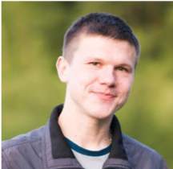

## Aliaksei Karneyeu

Senior DevOps / Cloud SRE — 10+ years in infrastructure and platform engineering.

Currently at [OpenX](https://openx.com), working on GCP, Kubernetes, and reliability.

**Focus areas:** GCP · AWS · Kubernetes · Terraform · CI/CD · Observability

## Contact

- **Email:** korneevayu (at) gmail.com
- **GitHub:** [korney4eg](https://github.com/korney4eg)
- **LinkedIn:** [aliaksei-karneyeu](https://www.linkedin.com/in/aliaksei-karneyeu-6064a745/)
- **Telegram:** [@korney4eg](https://t.me/korney4eg)

## About this blog

Here I share technical notes, ideas, and things I find interesting — mostly around DevOps, infrastructure, and cloud engineering.
