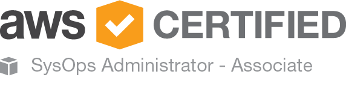

_Many companies offer learning budgets to grow their Employees. Some people spend them on courses, books. Some go to conferences, others get certificates. I was interested to get the “AWS Certified SysOps Administrator – Associate” certificate. In this post I gonna tell you what did it take me to prepare and pass this certification._
<!--more-->

Certificate “AWS Certified SysOps Administrator – Associate” shows that you know about AWS and can build reliable infrastructure on it. As other certification without practice it will not give too much advantage, but at least will highlight your CV in comparing to others.

First of all, I found a center where I can pass certification in Poland, so I don’t need to travel to other countries.

So I decided that not so much left to do: register and pay for certification, pass some training, read books and finally pass the certification. Simple!

Now I will describe all these steps one by one.

### Register and pay.

To register you need to go to the certification site and find a free time slot in the chosen location.

> Why in that order? Why shouldn’t you read books and pass courses first?

Answer for me is motivation. In case you chose books and courses to pass first you could always be not sure(сомневаться) about your level of knowledge. After registering the deadline is set. I had another example when I bought courses on black Friday and it took me 6 months to properly start preparation and register to the course, so this time I decided to set the deadline and have 1 month to prepare.

### Cources and other preparation materials.

#### 1. Linux Academy ([cources](https://linuxacademy.com/amazon-web-services/training/course/name/aws-certified-sysops-administrator-associate))

**Pros:**

- Materials greatly structured and go from basic to advanced.

- Practical labs, prepared with just one click and answers not only How? but also Why?.

- There is a forum where other students share their exams experience.

- Gives some example questions from certification.

**Cons:**

- subscription costs 50$, so it’s not the cheapest courses. On the other hand, you can learn a lot of other topics during your subscription period.

**Summary:**

_Not the cheapest source that gives you theoretical and practical knowledge. I decided to challenge myself and pass this course in 1 month of subscription. Definitely, if you spend 1-2 hours daily with passing all the practical labs it will take you about 2.5 weeks. The rest time I spend to pass “AWS Certified DevOps Engineer - Professional Level” preparation courses. **Recommend**_

#### 2. A Cloud Guru ([cources](https://acloud.guru/learn/aws-certified-sysops-administrator-associate))

**Pros:**

- Often on [udemy.com](https://www.udemy.com/courses/search/?q=aws%20sysops&src=ukw) you can get them discounted.

- Materials explained very detailedly, so you only need to get some practice experience.

- There is a forum where other students share their exams experience.

- Gives some example questions and hints for certification.

**Cons:**

- On the Cloud Guru [site](https://acloud.guru/) this course costs 99$, but you could also subscribe for 29$ and try to pass it in one month.

- In comparing to [linuxacademy.com](https://linuxacademy.com) you don’t get test labs and you need to have AWS account (anyway free tier would be enough).

- If you buy it on sales you could reduce your motivation to learn (for me it was the case, when I waited 6 months to start doing anything).

**Summary:**

_Not so expensive courses(if you have discounts) that give you detailed knowledge without practice that you should make separately.**Recommend**_

#### 3. AWS Certified SysOps Administrator Official Study Guide: Associate Exam 1st Edition ([сайт](https://www.amazon.com/Certified-SysOps-Administrator-Official-Study/dp/1119377420))

**Summary:**

_Book from Amazon that I haven’t read, even didn’t know about it when prepared to certification. Heard that others recommend it._

#### 4. Amazon certification preparation ([site](https://aws.amazon.com/ru/certification/certification-prep/))

**Summary:**

_Here you can find some examples of questions from exams. Gives some hints on certification._

### Preparation.

As I said previously I spend 1-2 hours per day working with theory and practice. Also, we use AWS for work, so this experience would be also a plus. Can recommend taking notes like, in university, it would structure your knowledge and compress it to a couple of pages that you could always restore.

### Just do it! Come and pass.

I would recommend coming before to the certification center, so you would have some time to find a proper office, prepare yourself and drink tea. Before you start the exam you would be asked to put all your gadgets and documents to the closed. I forgot to remove my smartwatches and lady that came after the exam was very surprised. Luckily I was not banned for this.

Exam longs about 80 minutes, you would have 60 questions with more than one right answers. After you pass the exam you got an email with your result and link to the certificate that will live 3 years.

## Conclusions

Probably you can successfully pass the exam without books and courses. For this, you need to carefully read all documentation for services and have working experience. I know people that have good practical experience couldn’t pass this exam on the second try. For this reason, I recommend using courses or book.

Also, I thought about passing the “AWS Certified DevOps Engineer - Professional” exam. I have passed courses for preparation to that exam but right now I don’t have a clue if it worth it but that is for one of the next posts.

What do you think about certification and had it ever helped you?
