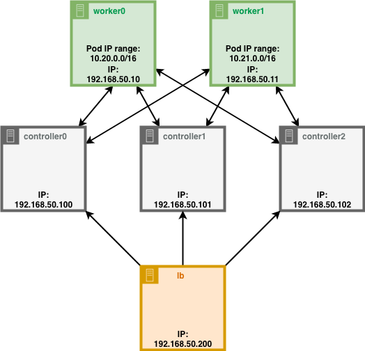

_For better understanding how kubernetes works I like to setup it myself. So here I will show how to setup kubernetes on the laptop using VirtualBox and Vagrant._

<!--more-->
One of big steps in preparation to CKA exam was to deploy kubernetes cluster locally. I started with great [guide from Kelsey Hightower called "Kubernetes The Hard Way"](https://github.com/kelseyhightower/kubernetes-the-hard-way)(or simply **KTHW**) and found out that it was created only for Google Cloud Platform. I decided to adopt it to my needs so cluster could be running on laptop (also work on PC).

This How-to is pretty big so it was splited into serveral parts.

## How-to structure:

1. [Intro. How cluster will look like. Network overview.](#)
2. Setup Vagrant, VirtualBox, downloading software
3. Provisioning Compute Resources
4. Provisioning all needed Certificates and keys, generating Kubernetes configuration files
5. Bootstrapping the etcd Cluster. Bootstrapping the Kubernetes Control Plane
7. Bootstrapping the Kubernetes Worker Nodes
8. Setup kubectl, provision needed Add-ons and plugins. Testing

## How cluster will look like

> **controller0**, **controller1**, **controller2** - Control Plane. Control center of whole kubernetes cluster.
> 
> **worker0**, **worker1** - nodes, where pods will be running.
> 
> **lb** - load balancer, will handle all requests to kubernetes Control Plane.

This structure allows to experiment with cluster and check how kubernetes will behave when one worker node is down, or controller node was destroyed. On the latest stages I will show you such examples.
