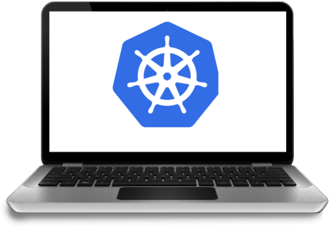

_One of big steps in my preparation for the CKA exam was to deploy the Kubernetes cluster locally. I started with a great [guide from Kelsey Hightower called "Kubernetes The Hard Way"](https://github.com/kelseyhightower/kubernetes-the-hard-way)(or simply **KTHW**) and found out that it was created only for Google Cloud Platform. I decided to adapt it to my needs so the cluster could be running on a laptop. In this series of posts I gonna show how to do this._
<!--more-->
> Before going through this How-to I would recommend reading [Kubernetes concepts](https://kubernetes.io/docs/concepts/architecture/) so that these posts would become more understandable. Anyway if you faced any issues during this lab feel free to ask in comments.

This How-to(Lab) is pretty big so it was split into several parts.

## Structure of this How-to:

1. [Intro. Cluster overview. Prepare local environment](#)
2. Setup Vagrant, VirtualBox. Create Virtual Machines.
4. Provisioning all needed Certificates and keys, generating Kubernetes configuration files
5. Bootstrapping the etcd Cluster. Bootstrapping the Kubernetes Control Plane
7. Bootstrapping the Kubernetes Worker Nodes
8. Setup kubectl, provision needed Add-ons, and plugins. Testing


## Cluster overview


> **controller0**, **controller1**, **controller2** - Control Plane. Control center of whole kubernetes cluster.
> 
> **worker0**, **worker1** - nodes, where pods will be running.
> 
> **lb** - load balancer, will handle all requests to kubernetes Control Plane.

This structure allows to experiment with cluster and check how Kubernetes will behave when one worker node is down, or controller node was destroyed. In the latest stages, I will show you such examples.

Ip addresses provided in the diagram - are internal IP addresses of VMs, so they can be easily accessed from laptop.


## Prepare a local environment

Before installing anything on Virtual Machines we need to install some programs first.

### kubectl

To be able to work with the Kubernetes cluster from the laptop client program needed.

##### Install on MacOS

```bash
brew install kubectl
```

##### Install on Linux

```bash
curl -LO https://storage.googleapis.com/kubernetes-release/release/`curl -s https://storage.googleapis.com/kubernetes-release/release/stable.txt`/bin/linux/amd64/kubectl
chmod +x ./kubectl
sudo mv ./kubectl /usr/local/bin/kubectl
```

#### Check that working

```bash
kubectl version
```
### cfssl
Program, which is the canonical command line utility using the CFSSL packages. ([link](https://github.com/cloudflare/cfssl))

##### Install on MacOS

```bash
curl -LO https://pkg.cfssl.org/R1.2/cfssl_darwin-amd64
chmod +x cfssl_darwin-amd64
sudo mv cfssl_darwin-amd64 /usr/local/bin/cfssl
```
##### Install on Linux

```bash
curl -LO https://pkg.cfssl.org/R1.2/cfssl_linux-amd64
chmod +x cfssl_linux-amd64
sudo mv cfssl_linux-amd64 /usr/local/bin/cfssl
```

#### Check that working

```bash
cfssl version
```

### cfssljson
Program, which takes the JSON output from the cfssl and multirootca programs and writes certificates, keys, CSRs, and bundles to disk([link](https://github.com/cloudflare/cfssl))

##### Install on MacOS

```bash
curl -LO https://pkg.cfssl.org/R1.2/cfssljson_darwin-amd64
chmod +x cfssljson_darwin-amd64
sudo mv cfssljson_darwin-amd64 /usr/local/bin/cfssl
```
##### Install on Linux

```bash
curl -LO https://pkg.cfssl.org/R1.2/cfssljson_linux-amd64
chmod +x cfssljson_linux-amd64
sudo mv cfssljson_linux-amd64 /usr/local/bin/cfssl
```
#### Check that working

```bash
cfssljson --version
```

## What's next

In the next section, we gonna set up Virtual Machines and add more preparations. Feel free to subscribe for [RSS feed](/feed.xml) and you wouldn't miss anything interesting.
