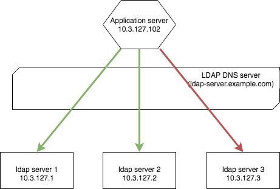

На работе словили интересный баг: время от времени апликуха не могла подключиться к LDAP серверу и ругалась в логи.
<!--more-->

Так как баг проявлялся не всегда, а мониторинг показывал, что LDAP сервера работали 100% времени и проблем никаких не было, значит проблема с подключением. После выйснения деталей архитектуры оказалось, что любой запрос к ldap-server.example.com перекидывался к одному из LDAP серверов(10.3.127.1, 10.3.127.2, 10.3.127.3) и скорее всего к какому-то из серверов не может подключиться.



Сначала кинулся вылавливать ошибки в сети через `tcpdump`, но так как я его не умею пока готовить, то получил несколько мегабайт данных сетевого соединения. Второй идеей было посмотреть текущие запросы к LDAP серверу.
```bash
root@appserver102 ~#: netstat -natpul |grep :389

tcp        0      0 10.3.127.102:43690          10.3.127.2:389           CLOSED   16947/java
tcp        0      0 10.3.127.102:43693          10.3.127.1:389           CLOSED   16947/java
tcp        0      0 10.3.127.102:43571          10.3.127.3:389           SYN_SENT 16947/java
```

*"Ну вот он, голубчик!"*

Как видно из скриншота, третье соединение повисло в состоянии `SYN_SENT` - ожидает ответа от сервера. Если повторить эту команду через некоторое время, соединение будет держаться, пока не наступит таймаут.(Лече всего посмотреть командой `watch 'netstat -natpul |grep :389'`). Видимо это и есть проблемное соединение.
Чтобы починить эту ошибку, нужно разрешить доступ от *appserver102*(10.3.127.102) к *ldap-server3*(10.3.127.3)

## Вывод

Очень часто для диагностики работы системы и сети достаточно стандартных линуксовых утилит.
