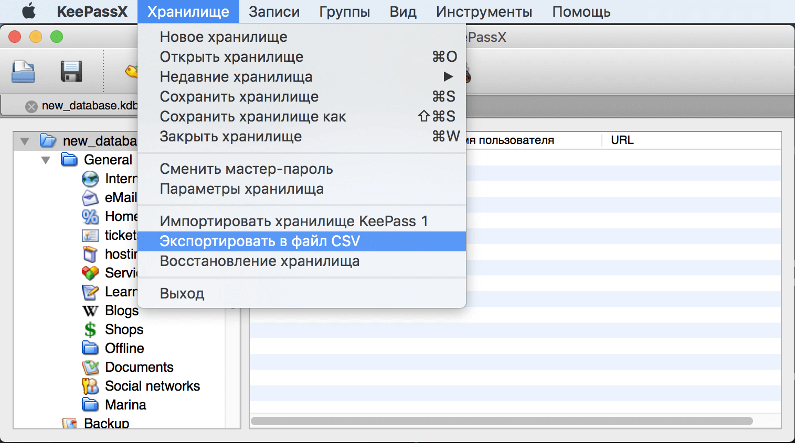
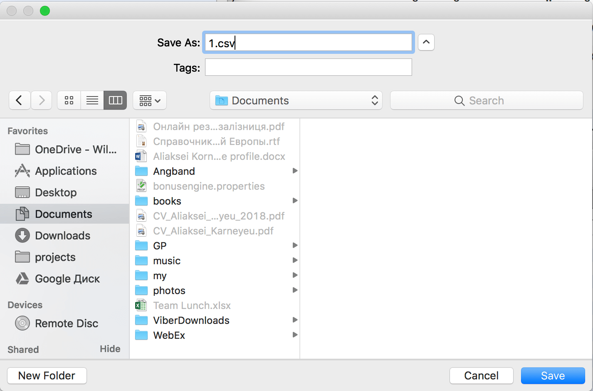

Пользоваться синхронизацией паролей очень удобно: вводишь на телефоне, и вот он есть на компьютере, и наоборот. Для этих целей я использую [KeePassX](https://www.keepassx.org/) как менеджер паролей, база с которыми хранится в [Dropbox](https://www.dropbox.com/) для синхронизации. Но в один прекрасный день Dropbox в офисе заблокировали.

Я этого сразу не заметил и вводил пароли то на телефон, то на компьютер. И только через какое-то время увидел, что некоторых паролей с телефона нет на компьютере и паролей с компьютера - на телефоне.

Что бы всё это исправить нужно:
<!--more-->
1. найти отличия в базах
2. устранить отличия
3. возобновить синхронизацию даже при заблокированном сервисе

Для начала скачиваем базу с паролями с Dropbox где-нибудь, где доступ не заблокирован, например дома.
Назовём базу, которая была на компьютере - *локальная*, а базу, используемую в Dropbox (на телефоне) - *скаченная*.

К сожалению KeePassX не позволяет сравнить две базы, а тем более слить их вместе, зато, к счастью, можно экспортировать базу в CSV файл(текстовый формат, предназначенный для представления табличных данных, где столбцы разделены запятыми, а каждая строка в файле соответствует строке в таблице).

Открываем *локальную* базу в KeePassX,затем в меню "Хранилище" -> "Экспортировать в файл CSV" (как показано на рисунке снизу) 



сохраняем в папку с документами как `1.csv`. Здесь папка с документами - `~/Documents/`



Точно так же открываем *скаченную* базу и экспортируем её в файл `~/Documents/2.csv`

Для того, чтобы найти отличия в этих файлах я воспользуюсь инструментами коммандой строки(терминалом), но можно открыть эти два файла в текстовом редакторе сравнить. Кстати, в современных редакторах встроенна функция сравнения двух файлов: [Visual Studio Code](https://www.meziantou.net/2018/03/19/comparing-files-using-visual-studio-code)(на английском), [NotePad++](https://abuzov.ru/kak-sravnit-dva-fajla/), [Плагин для Atom](https://atom.io/packages/compare-files). 

На MacOS и Linux в терминале можно воспользоваться коммандой `diff ~/Documents/1.csv ~/Documents/2.csv`:
```bash
diff ~/Documents/1.csv ~/Documents/2.csv
32c32
< "new_database/General/Services","Uber","myemail@gmail.com","SecurePassw0rd1","https://uber.com",""
---
> "new_database/General/Services","Uber","myemail@gmail.com","1SecurePassw0rd","https://uber.com",""
```
Как видно, отличие только в одной записи к паролю для Uber. Проверяем какой пароль верный и заносим его в базу.

Всё, расхождения устранены, теперь можно периодически из дома синхронизировать базу [скриптом](https://github.com/dropbox/dropbox-sdk-python/blob/master/example/updown.py)


Пока я разбирался, как решить вопрос с рассинхронностью данных, нашёл несколько хороших решений для хранения и синхронизации паролей. О них напишу в одном из следующих постов.
