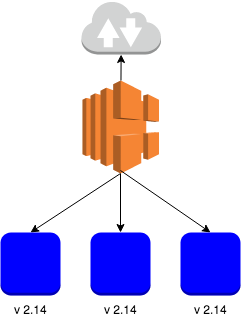
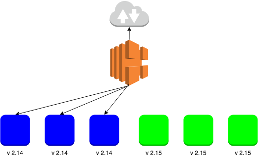
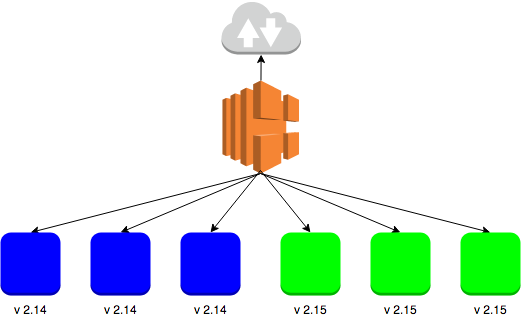
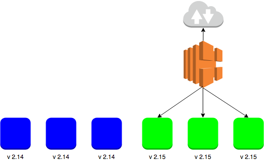
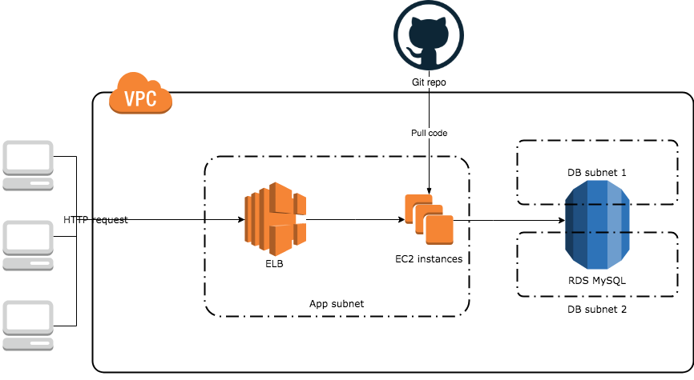

В этой статье я хочу показать простейший способ, как организовать непрерывное обновление сервиса в AWS при помощи [ Ansible ]( https://www.ansible.com/).

Для примера будем разворачивать [ сервис ](https://github.com/korney4eg/birthday-checker), который позволяет узнать сколько осталось дней до дня рождения пользователя в этом году. В качестве базы данных будет использован RDS с MySQL, в качестве лоад балансера - Elastic Load Balancer.
 
_Предполагается, что читатель знает азы работы с ansible и AWS, они установлены и настроены._
<!--more-->

## Blue-Green Deployment

Идея заключается в следующем:

1. У нас есть несколько виртуальных машин на которых работает приложение версии 2.14, назовём эти машины - синими(Blue). Запросы на них приходят от пользователей через лоад балансер.



2. Создаём новые виртуальные машины с приложением версии 2.15, они у нас будут зелёными(Green).



3. Подключаем зелёные виртуалки к лоад балансеру. Очень важно убедиться в том, что работают как синие виртуалки, так и зеленые. То есть можно открыть приложение версии 2.14, так и 2.15.



4. Отключаем синие виртуалки от балансера.



5. По прошествии какого-то времени, можно удалять синие виртуалки. Подождать нужно на всякий случай, чтобы при необходимости можно было легко откатиться к старой версии.

Этот вид развёртывания неприемлим, если есть калечещие измениния в базе данных при переходе на новую версию приложения.
Цвета необязательно должны быть именно синий и зелёный, можно использовать любой другой.


## Архитектура

В общем виде архитектура выглядит следующим образом:



Создается виртуальное приватное облако(Virtual Private Cloud, **VPC**), в нём 3 подсети (subnets). Первая подсеть публичная(**App subnet**), в ней будут запускаться виртуалки с приложением(**EC2 instances**) и лоад балансер(**ELB**), доступный из интернета. Две другие - приватные, в них будет работать база данныхi(**DB subnet 1**, **DB subnet 2**). Так же добавляем Internet Gateway, через который виртуалки могут достукиваться в интернет.

Создаются правила Security rules для:

1. Лоад балансера - открыт 80-й порт для всех.

2. Апликейшн сервера - открыт 22-й порт для ssh соединения, 8001-й для лоад балансера.

3. Сервера баз данных - открыт 3306-й порт для апликейшн серверов.

Для того, чтобы развернуть сервис баз данных, сначала нужно создать группу сетей базы данных([DB Subnets group](https://docs.aws.amazon.com/en_us/AmazonRDS/latest/UserGuide/USER_VPC.WorkingWithRDSInstanceinaVPC.html#USER_VPC.Subnets)), которая включает в себя 2 подсети. Делается это для того, чтобы можно было настроить базу данных высокой доступности. В этом примере этого не используется, но я очень рекоммендую. Дальше создаётся сервис базы данных на MySQL 5.7.


## Реализация

По [ ссылке ](https://github.com/korney4eg/blue-green-deployment-ansible/blob/master/provision.yaml) можно посмотреть плейбук полностью. Дальше будут рассмотрены задания отвечающие только за blue-green deployment.

### Используемые переменные


```yaml
    region: eu-west-1
    db_name: myTestDB
    db_user: myuser
    db_password: 12345678
    version: 2.15
    instance_num: 1
```

&nbsp;&nbsp;&nbsp;&nbsp;&nbsp;&nbsp;**region:** - регион AWS, в этом примере используется регион в Ирландии

&nbsp;&nbsp;&nbsp;&nbsp;&nbsp;&nbsp;**db_name:** - название базы данных

&nbsp;&nbsp;&nbsp;&nbsp;&nbsp;&nbsp;**db_user:** - имя пользователя бызы данных

&nbsp;&nbsp;&nbsp;&nbsp;&nbsp;&nbsp;**db_password:** - пароль к базе данных

&nbsp;&nbsp;&nbsp;&nbsp;&nbsp;&nbsp;**version:** - версия приложения

&nbsp;&nbsp;&nbsp;&nbsp;&nbsp;&nbsp;**instance_num:** - количество инстансов, на которых будет работать приложение.


### 1. Проверка, были ли запущены виртуалки(Blue) раньше

Перед тем, как создавать новые виртуальные машины, убедимся, сколько их уже было создано и запущено.

Собираем данные о виртуалках с таким же тегом, и потом создаём список из айдишников найденных виртуалок.

```yaml
    - set_fact:
        old_instance_ids: []
        new_instance_ids: []

    - name: Get old instances
      ec2_remote_facts:
        filters:
          vpc_id: "{{ vpc.vpc.id }}"
          instance-state-name: running
          "tag:Name": MyTestApp
        region: "{{ region }}"
      register: old_instances

    - name: get old instances ids
      set_fact:
        old_instance_ids: "{{old_instance_ids}} + ['{{ item.id }}']"
      loop: "{{old_instances.instances}}"
```


### 2. Создаём виртуалки с новой версией приложения (Green)

#### 2.1 Шаблон скрипта запуска приложения

В AWS можно прописать скрипт, который будет выполняться сразу после создания виртуальной машины. Для этого создаём файл `setup.sh.j2`, со следующим содержанием:

```bash
#!/bin/bash
yum install python mysql57 git telnet nginx -y

useradd serv_runner

cd /opt/

git clone https://github.com/korney4eg/birthday-checker person_api
chown serv_runner:serv_runner person_api -R
cd person_api/
pip install -r requirements.txt


# create config file
echo '
[database]
host = {{ rds.instance.endpoint }}
port = 3306
database = {{ db_name }}
user = {{ db_user }}
password = {{ db_password }}' > /opt/person_api/.db_config.ini

# nginx configuration
echo '
server {
    listen      8081  default_server;
    location = /healthcheck {
        add_header Content-Type text/plain;
    	return 200 '{{ version }}';
    }
    location = /stack {
        add_header Content-Type text/plain;
    	return 200 '$(hostname)';
    }
    location /{
        proxy_pass http://127.0.0.1:8080;
        proxy_set_header Host $host;
        proxy_set_header X-Real-IP $remote_addr;
        proxy_set_header X-Forwarded-For $proxy_add_x_forwarded_for;
        proxy_set_header X-Forwarded-Proto $scheme;
    }
}' > /etc/nginx/conf.d/virtual.conf
service nginx restart

su - serv_runner -c "cd /opt/person_api/ && nohup python main.py >> /tmp/person_api.log 2>&1 &"
```

Этот скрипт устанавливает все зависимости, скачивает приложение, настраивает и запускает.
Шаблон используется для того, чтобы при смене одного из параметров не нужно было менять файл скрипта, он настраивается автоматически.


#### 2.2. Создаём новые виртуалки(Green)

Для создания виртуальных машин нужно указать несколько параметров, одним из таких является "пара ключей"(ec2 keypair), другим скрипт запуска(user_data), его мы создали на шаге 2.1.

Также записываем в переменную _new_instance_ids_ айдишники новых инстансов(витруалок).

```yaml
    - name: create a new ec2 key pair
      ec2_key:
        name: provisioner
        region: "{{ region }}"
        key_material: "{{ lookup('file', '~/.ssh/id_rsa.pub') }}"
      register: keypair

    - name: Creating database coniguration template
      template:
        src: ./setup.sh.j2
        dest: ./setup.sh

    - name: Create EC2 server
      ec2:
        image: ami-41505fab
        wait: yes
        instance_type: t2.micro
        region: "{{ region }}"
        group_id: "{{ app_sg.group_id }}"
        vpc_subnet_id: "{{ app_subnet.subnet.id }}"
        key_name: "{{ keypair.key.name  }}"
        count_tag: "{{ old_instance_ids|length + instance_num  |int}}"
        user_data: "{{ lookup('file', './setup.sh') }}"
        exact_count: "{{ old_instance_ids|length + instance_num  |int}}"
        instance_tags:
          Environment: MyTest
          Name: MyTestApp
      register: ec2

    - name: get new instances ids
      set_fact:
        new_instance_ids: "{{ec2.instance_ids}}"
        all_instances: "{{old_instance_ids}}+{{new_instance_ids}}"

    - name: get new instances ids
      set_fact:
        all_instances: "{{old_instance_ids}}+{{new_instance_ids}}"
```


### 3. Подключаем новые инстансы(Green) к лоад балансеру

В параметр **instance_ids** прописываем айдишники новых виртуалок.

```yaml
    - name: Create ELB with all instances
      ec2_elb_lb:
        name: "app-lb"
        state: present
        security_group_ids:
          - "{{ elb_sg.group_id }}"
        region: "{{ region }}"
        instance_ids: "{{ new_instance_ids }}"
        subnets:
          - "{{ app_subnet.subnet.id}}"
        listeners:
          - protocol: http
            load_balancer_port: 80
            instance_port: 8081
        health_check:
            ping_protocol: http # options are http, https, ssl, tcp
            ping_port: 8081
            ping_path: "/healthcheck" # not required for tcp or ssl
            response_timeout: 15 # seconds
            interval: 30 # seconds
            unhealthy_threshold: 2
            healthy_threshold: 2
        tags:
          Environment: MyTest

    - name: Waiting for instances to become ready
      ec2_elb_facts:
        region: "{{ region }}"
        names: app-lb
      register: elb_facts
      until: elb_facts.elbs[0].instances_inservice_count  == all_instances|length
      retries: 10
      delay: 15
```

Так как установка программ занимает какое-то время, то ждём, пока все инстансы увидит лоад балансер как работающие.

### 4. Отключаем старые виртуалки(Blue) от балансировщика

После того, когда новые виртуалки запустились, старые можно смело отключать от балансера.

```yaml
    - name: Remove old instances from ELB
      ec2_elb_lb:
        name: "app-lb"
        state: present
        security_group_ids:
          - "{{ elb_sg.group_id }}"
        region: "{{ region }}"
        instance_ids: "{{ new_instance_ids }}"
        subnets:
          - "{{ app_subnet.subnet.id}}"
        listeners:
          - protocol: http
            load_balancer_port: 80
            instance_port: 8081
        health_check:
            ping_protocol: http # options are http, https, ssl, tcp
            ping_port: 8081
            ping_path: "/healthcheck" # not required for tcp or ssl
            response_timeout: 15 # seconds
            interval: 30 # seconds
            unhealthy_threshold: 2
            healthy_threshold: 2
        purge_instance_ids: true
      when: old_instance_ids.0 is defined
```


### 5. Если всё хорошо работает какое-то время, удаляем старые виртуалки(Blue)

```yaml
    - name: Terminate instances that were previously launched
      ec2:
        state: 'absent'
        instance_ids: '{{ old_instance_ids }}'
        region: "{{ region }}"
        group_id: "{{ app_sg.group_id }}"
        vpc_subnet_id: "{{ app_subnet.subnet.id }}"
      when: old_instance_ids.0 is defined
```

## Запускаем ansible

Ещё раз продублирую [ ссылку ](https://github.com/korney4eg/blue-green-deployment-ansible/blob/master/provision.yaml) на полный плейбук.


Проще всего будет склонировать весь репозиторий и запустить скрипт:
```bash
git clone https://github.com/korney4eg/blue-green-deployment-ansible
cd blue-green-deployment-ansible/
ansible-playbook provision.yaml  -v
```

Чтобы вам долго не мучаться с удалением только что создых ресурсов я подготовил скрипт, который удаляет всё в обратном порядке, для этого нужно выполнить следующую команду:
```bash
ansible-playbook destroy.yaml  -v
```

## Заключение
На этом примере был рассмотрен один из видов беспрерывного развёртывания (Zero-downtime deployment) - цветное(Blue-Green) развёртывание. У этого способа есть недостаток - в какой-то момент времени храняться как синие, так и зелёные виртуалки, что ненамного увеличивает стоимость.

Как можно было сделать по другому:

1. Использовать Kubernetes или другую систему оркестрации. Был выбран именно текущий способ, чтобы показать на низком уровне как можно всё организовать самостоятельно.

2. Использовать Autoscaling Groups. Во-первых, ASG загружается дольше, а значит его дольше зупускать и отлаживать (для продакшена я рекоммендую использовать именно ASG), во-вторых, опять-таки на инстансах всё наглядней показано.

3. Использовать любой другой Configuration Manager. Ansible в этом примере был выбран как более читабельный. Другие примеры развёртки тоже будут использовать Ansible.
