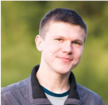

## About me

Hey, my name is Aliaksei Karneyeu!

In IT started in 2009 as Windows XP administrator, learned Linux. Accidentally ended up in DevOps in 2013, since then working on that field.

Worked with public cloud:
 - AWS
 - Digital Ocean

Like to play and experiment with kubernetes, unless starting it in the work.

Favorite programming languages:
 - Golang
 - Ruby
 - Python
 - Bash

If you need to contact me or ask any questions:

e-mail: korneevayu (sobaka) gmail.com,

GitHub: [ korney4eg ](github.com/korney4eg/)

twitter: [ @kornei4 ](https://twitter.com/kornei4)

Телеграмм: [@korney4eg]( https://t.me/korney4eg )

LinkedIn: [aliaksei-karneyeu](https://www.linkedin.com/in/aliaksei-karneyeu-6064a745/)

## Badges

## About this blog

Here I would like to share my ideas and experience.

Main purpose:

  - Help with a problem that I solved sometime

  - Note something that is interesting for me

  - My ideas and impressions
