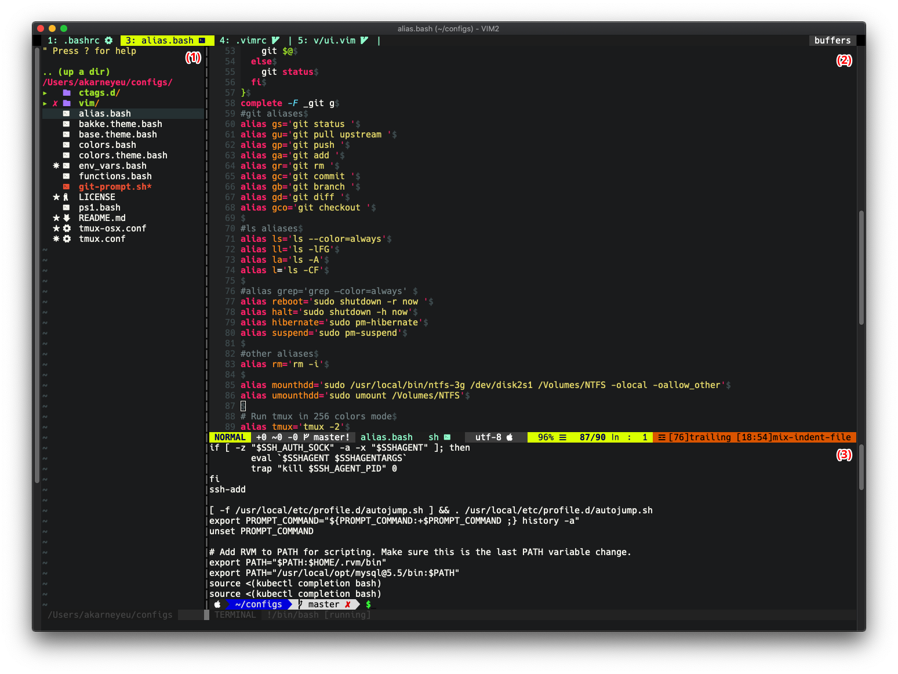
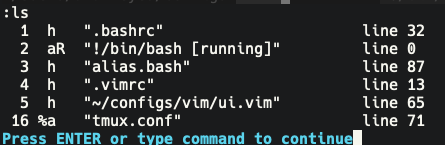
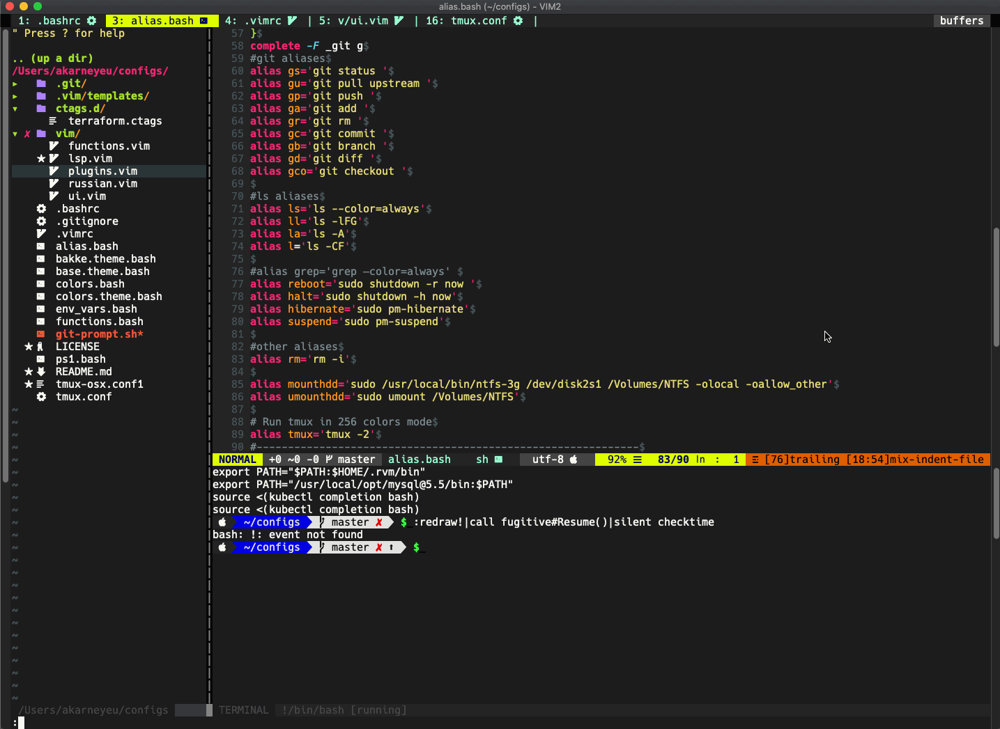
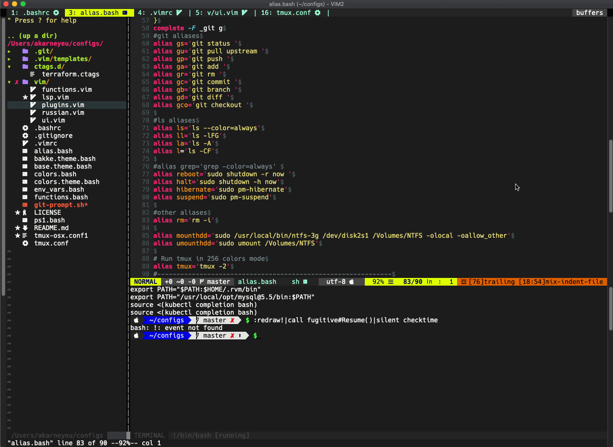

_I've been using Vim for about 5 years. During this time I tried other text editors and IDEs, in the end I always moved back. Some features I like in Vim, some I like in other IDEs. One such feature - is to switch between files. In today's post, I would like to show how Vim allows to jump between files._

<!--more-->


I suppose that reader is already familiar with modes in Vim (Insert mode, Command mode, and Visual mode). If no  - I would suggest passing `vimtutor` (it's available in almost all Linux distros and MacOs X), it would take you not more then 15-20 minutes.


Right now my screen in Vim has following parts: **(1)** - file structure(NERDTree plugin), **(2)** opened file and **(3)** terminal emulator.




Looks pretty, doesn't it?


Any file, terminal emulator, file tree, quick-fix window, or any other information stored in a buffer, so each opened file has its buffer, a terminal on own. The best analogy would be to imaging the modern (in 2020) browser, where each tab is a new site.

The areas **(1)**,**(2)** and **(3)** in Vim called **(windows)**, they(windows) allow to arrange buffers on the screen.


Our aim here to learn how to switch between opened files(buffers) in window **(2)**.

Get a list of opened files
---

To get a list of available buffers just enter command `:ls` in normal mode. You would see something like this.




Entering command is only available from Normal mode(press Esc key), then just write your command with `:` in the beginning and hit *Enter* button. Commands are visible in the bottom left corner of the Vim window.


First column - buffer number, second - buffer type and properties, third - name of the buffer. In this example buffer named `.bashrc` has number 1, `alias.bash` - number 3, terminal - number 2.

I installed the plugin, so that buffer names displayed on top of the Vim window, same as in a browser. Pretty handy, I would say. (Link would be down below the post)


Switch using buffers number
---

The quick and native way in Vim - just to enter command `:b 1`. Command `:b`, or it's full version `:buffer` tells Vim open buffer, and `1` - list number of the needed buffer. If we would like to open `.vimrc`, then our command should look like `:b 4`. It's even possible to use the command without space, so it looks like `:b4`. Let's try to switch in `.bashrc` first, then to `.vimrc`, and finally back to `alias.bash`.


**Pros:**
* Small command, could be typed quickly

**Cons:**
* Need to know buffer numbers. It's fine when there are only 5 buffers opened, and how about 20?

Switch using buffers name
---

This way is not as fast as previous, although it's much more useful when many files opened.

Command `:b` allows switching by name of buffer(file), not an only number. Just type unique name and hit *Enter*. For example, let's try to switch on `.bashrc` -  enter command `:b bashr` and hit *Enter*. If you type nonunique name, Vim will show you an error.

My favorite super-duper feature of Vim is buffer name autocompletion. Just type part of filename after command `:b ` and hit *Tab* key. Let's try to enter command `:b ui` and hit *Tab* - Vim found only single filename containing `"ui""` in it's name(`vim/ui.vim`) and just opened it.



If you enter nonunique part of a filename and hit *Tab* couple of times, vim show you what buffers have this name one-by-one.

**Pros:**
* Filename autocompletion
* Still quick command to type

**Cons:**
* You need to remember the filename

Quick switch between two buffers
---

Sometimes only two files (html and css files) opened and you want to quickly between them, Vim has a built-in feature for this - press `Ctrl+6` keys.

Let's try to swtich between `alias.bash` and `vim/ui.vim`.



**Pros:**
* Fastest way to switch
* No need to enter any commands

**Cons:**
* Switching only between two files, wouldn't work with more.

Switch buffers sequentially
---

In browsers (Google Chrome, Mozilla Firefox, or Safari) it's possible to quickly switch between tabs using keys *Ctrl+Tab* and *Ctrl+Shift+Tag*.

To do same thing in vime there are built-in commands `:bnext` and `:brevious`. Let's assign *Ctrl+Tab* to command `:bnext` to switch to next buffer, and *Ctrl+Shift+Tab* to `:bprevious`. To do this we need to enter following commands:

```vim
:nnoremap <C-Tab> :bnext<CR>
:nnoremap <C-S-Tab> :bprevious<CR>
```

`<CR>` - in the command equals hitting *Enter* key.


If you want to save this keymapping permanently add following code to `~/.vimrc` file

```vim
nnoremap <C-Tab> :bnext<CR>
nnoremap <C-S-Tab> :bprevious<CR>
```

As you can see in vim default configuration file `~/.vimrc` you can write the same commands that you write here. Just remove `:` before the command and save the file. Next time you open vim, it will have this mapping working.



Everything is great except the moment when switching to the terminal. Before switching from the terminal buffer you need to enter command mode by pressing keys *Ctrl+W+N*. As was written earlier buffers represent not only files, also terminal and many more things.

What can we do with it? Let's try writing more "clever" functions that would skip all non-files buffers.

First thing - to understand if buffer under provided number(index) is a regular file or anything else. 

Type command:

```vim
:function! IsValidBuffer(index)
    return !empty(bufname(a:index)) && empty(getbufvar(a:index, '&buftype'))
endfunction
```

Buffer with the file should pass the following checks:
1. `!empty(bufname(a:index))` - check that buffer name with number `index` shouldn't be empty
2. `empty(getbufvar(a:index, '&buftype'))` - check variable `&buftype` of buffer with number `index` is not empty. For terminal it would equal to `terminal`.

Now it's time to write function, that finds the next buffer and checks if this buffer contains the file or anything else using function `IsValidBuffer()`.

```vim
:function! NextBuffer()
  let ind = bufnr()
  let ind += 1
  while ind != bufnr()
    if ind > bufnr('$')
      let ind = 1
    endif
    if IsValidBuffer(ind)
      break
    else
      let ind += 1
    endif
  endwhile
  execute "buffer" ind
endfunction
```

This function does the following:
1. Save current buffer number to variable `ind`
2. Increment variable `ind` by 1, until we get back to the initial buffer. If the last buffer reached then `ind` become 1.
3. For each buffer with number `ind` check if it's a normal file or not. If it's a normal file then switch to it.

Let's write function that switching backward:

```vim
:function! PreviousBuffer()
  let ind = bufnr()
  let ind -= 1
  while ind != bufnr('')
    if ind < 1
      let ind = bufnr('$')
    endif
    if IsValidBuffer(ind)
      break
    else
      let ind -= 1
    endif
  endwhile
  execute "buffer" ind
endfunction
```

Now let's bind keys to this functions:

```vim
:nnoremap <C-Tab>  :call NextBuffer()<CR>
:nnoremap <C-S-Tab> :call PreviousBuffer()<CR>
```

Command `:call` calls function.

**Pros:**
* Even faster switch between buffers
* No need to enter any commands

Useful links:
---
* Vim plugin to show buffer names on the top(like tabs) - https://github.com/vim-airline/vim-airline
* Vim plugin for more advanced work with buffers - https://github.com/jlanzarotta/bufexplorer

Afterword
---

Thank you for finishing this post. Hope it helped anybody to learn something in Vim.
