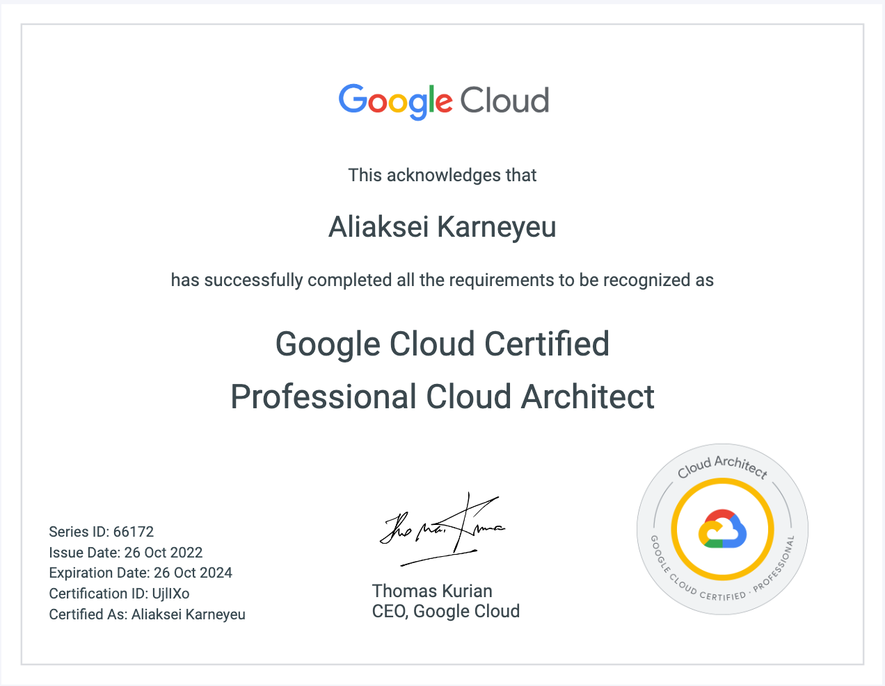

_On the 24th of October 2022 I successfully passed the "Google Cloud Professional Architect" certification and here I would like to share how I prepared for this exam, some pieces of advice on what to learn, and some of my thoughts on such kinds of exams in total._
<!--more-->

I have already passed some certifications like [Certified Kubernetes Administrator](https://www.credly.com/badges/d20e7506-e328-48fa-b148-730cf3532878/linked_in_profile)(valid till May 2023), "AWS Certified SysOps Administrator - Associate"(expired on April 2021) and AWS Certified Solutions Architect - Associate (expired on July 2020), and I didn't have any intentions to get one more to myself. This year company where I'm working right now proposed to pass Google Cloud Professional Architect certification.

And here you are 

## What I used for preparation

### "Google Cloud Professional Architect: Get Certified 2022" course on Udemy

[link to the course](https://www.udemy.com/course/google-cloud-professional-architect-get-certified/)

**Pros**:
* gives introduction from zero, so if you don't have any experience in GCP and you don't need to learn something new ahead
* if you already worked with GCP, the course cover details from most of the services and processes in GCP.

**Cons**:
* not all technologies are covered, so you need to find more sources for learning
* number of tests is pretty small, so you wouldn't be able to practice tests

**Summary**:
I can recommend buying this course as an initial step in preparation for certification. Also on Udemy from time to time, you can find such courses with discounts.

### "Google Cloud Certified Professional Cloud Architect" course on whizlabs

[link to the course](https://www.whizlabs.com/google-cloud-certified-professional-cloud-architect/)

As I found out it was not so long before the exam, so I bought practice tests, so here is my feedback on tests.

**Pros**:
* questions are the same as on exams
* pretty big amount of questions to practice
* questions are divided into sets of 50 and also questions are grouped by topic, so if you need to practice single technology - it's worse.
* wide range of technologies covered in questions.

**Cons**:
* couldn't find

**Summary**:
Those practice tests are a dump of official tests on exams, so working with them I prepared a lot. Topics on Hands-on Labs seem legit and probably can help you in understanding.

## Suggestions to myself from the past
What I haven't started doing from the beginning - I didn't take notes and watched Coursera videos like some shows on Netflix. Without notes, I couldn't differentiate for a long time between [BigQuery](https://cloud.google.com/bigquery/) and [BigTable](https://cloud.google.com/bigtable/), or between [Cloud DataProc](https://cloud.google.com/dataproc), [Cloud DataFlow](https://cloud.google.com/dataflow) and [Cloud Data Fusion](https://cloud.google.com/data-fusion/).

Thank you for still reading it. 

## My thoughts on such kinds of exams
I don't like exams that try to trick you with wording, instead of checking your knowledge. The certification that I liked most of all - is "Certified Kubernetes Administrator", which has practical tasks. Anyway from preparing for exams I found useful improvements to our current infrastructure.

What are your favorite/dislikable exams that you had after graduating?
