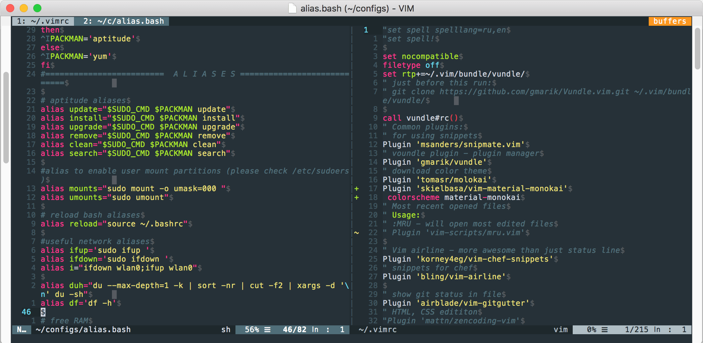
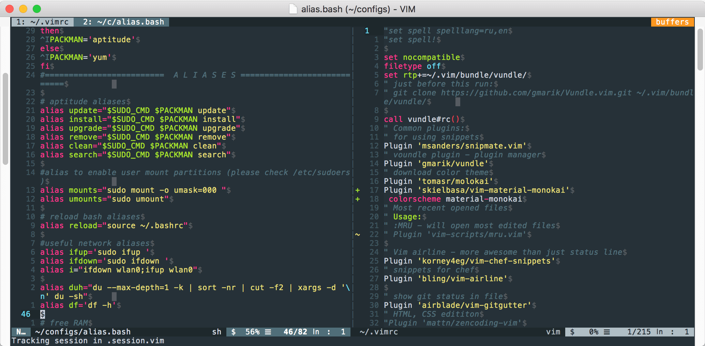
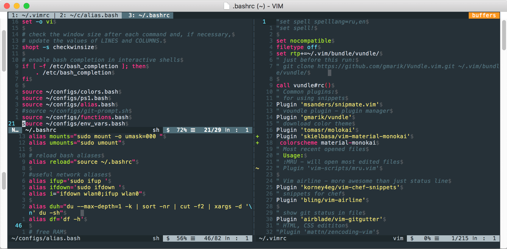
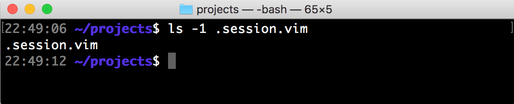
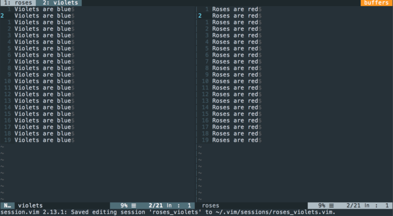
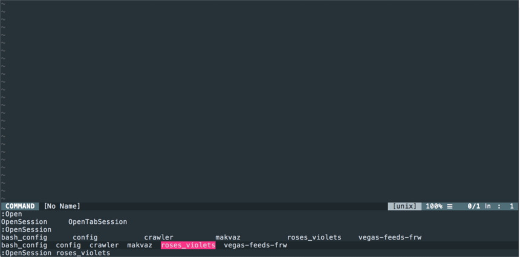

В [прошлой статье](../10/vim-sessions.html) мы разобрали что такое сессии в VIM и как их можно использовать. Конечно в интернете есть много плагинов для работы с сессиями и самые интересные я хочу разобрать.
<!--more-->

## vim-obsession

[Ссылка на скачивание](https://github.com/vphantom/vim-obsession)В текущей папке, в которой был открыт редактор, создается файл `.session.vim`, куда автоматически сохраняется состояние окон и буферов.

Рассмотрим на примере:

В редакторе открыто два вертикально разделенных окна.[

Вводим команду `:Obsession`.[

Теперь Vim будет записывать все наши операции с окнами и буферами в файл `.session.vim` в текущем каталогe. Попробуем открыть ещё одно окно, но уже горизонтально.[

Можно спокойно закрыть редактор командой `:wqa` и глянуть в текущую папку[

Убедившись, что файл `.session.vim` существует в текущей папке просто открываем vim без каких-либо аргументов. Открылось тоже самое окно, даже NERDTree подсветил нужный файл (для этого нужно немного настроить его)

Для того, чтобы приостановить записывать сессию достаточно ещё раз ввести команду `:Obsession`.

Плюсы:

- повторяет свойство IDE запоминать все окна в текущем проекте Минусы:
- Активируется только, если vim запущен без аргументов (может это и плюс)
- Не всегда корректно открывает окна плагинов, таких как `NERDTree`, `ctags`

## vim-session

[Ссылка на скачивание](https://github.com/xolox/vim-session)

Плагин создает единую директорию и хранит там все сессии.

Посмотрим на примере:

Открываем нужные файлы в Vim, и прописываем команду`:SaveSession roses_violets`[

Сессия сохранилась в директорию _~/.vim/sessions/_. Теперь можно закрыть редактор (перед выходом вылезает окно, в котором спрашивается, сохранить ли сессию или нет. Выбираем “Да”) и открыть без аргументов в домашней папке (при условии, что мы не сохраняли сессии в ней с vim-obsession). Набираем команду `:OpenSession ` и клавиш **TAB** , плагин подсказывает, какие сессии можно загрузить.[Плюсы:

- Можно посмотреть список сессий и открыть нужную из любого места
- Много разных опций по настройке, например, название сессии по-умолчанию. Минусы:
- Не всегда корректно открывает окна плагинов, таких как `NERDTree`, `ctags`

## заключение

В заключении хочу сказать, что работа с сессиями ускоряет настройку окружения в редакторе, открытие всех нужных буферов и окон. Лично мне больше импонирует vim-obsession, хотя у vim-session тоже есть свои плюсы. В этой заметке не рассматривались ещё такие плагины:

- [vim-workspace](https://github.com/thaerkh/vim-workspace) - по свойствам очень напоминает vim-obsession, просто исполняется другими командами
- [vim-startify](https://github.com/mhinz/vim-startify) - меняет стартовое окно Vim, где показаны недавно открытые файлы, сессии или закладки.
 Опубликовано December 12th, 2017 , автор - Алексей Корнеев 
Поделиться

