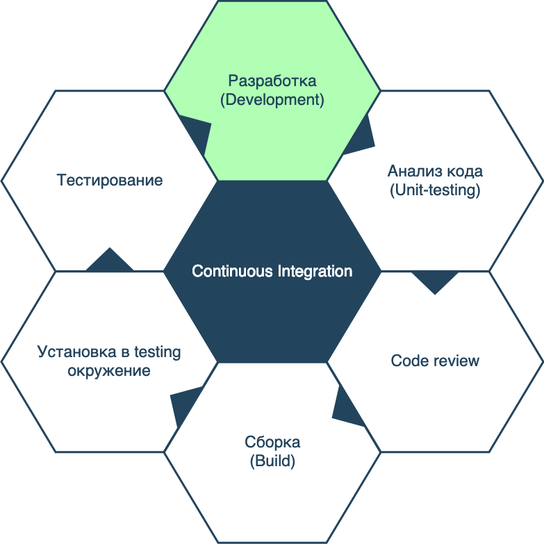
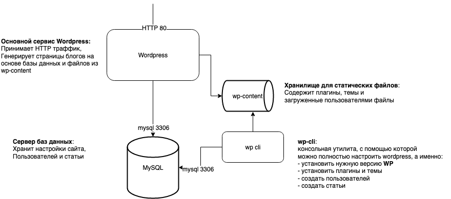
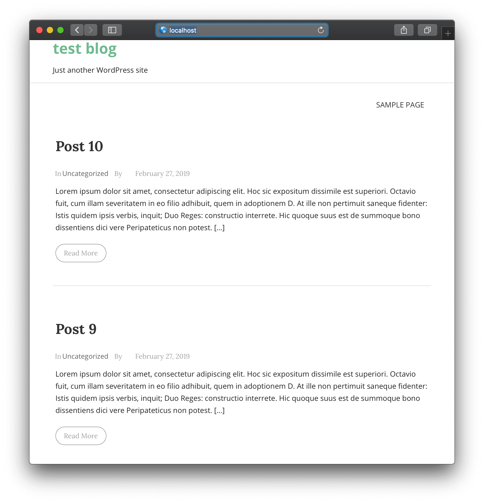
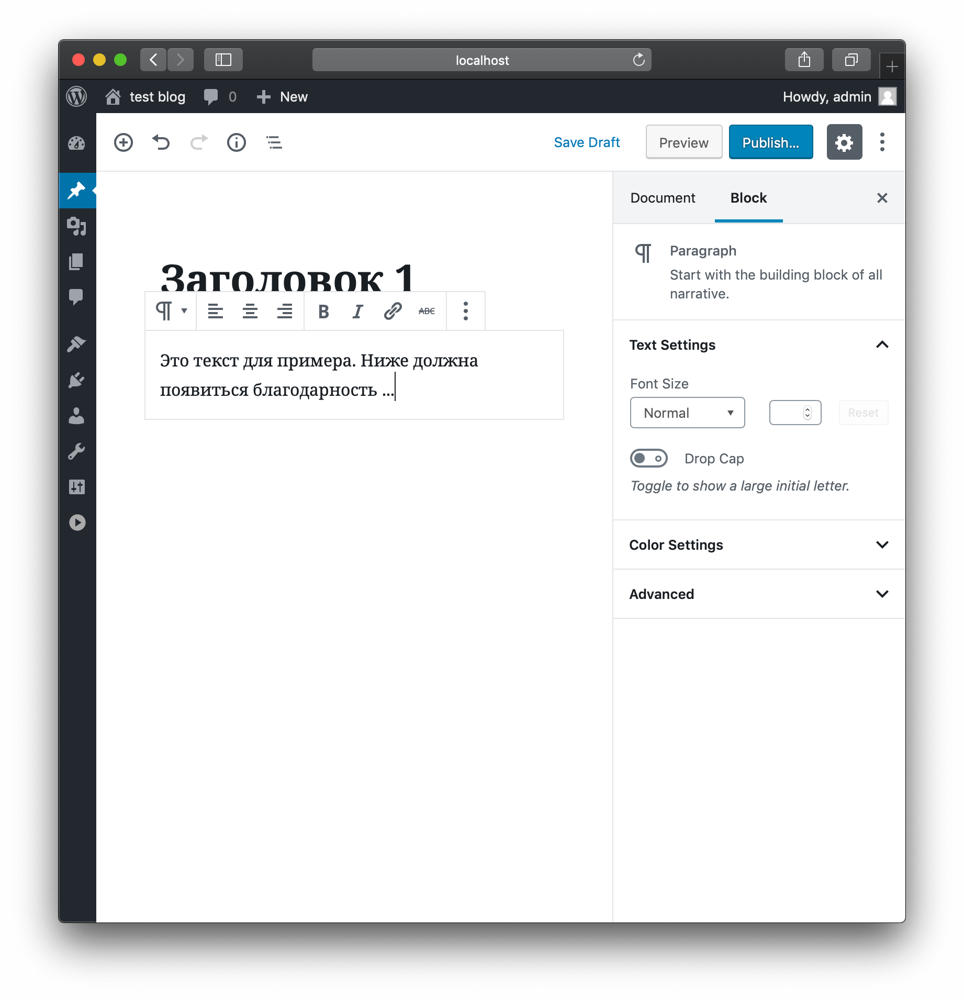
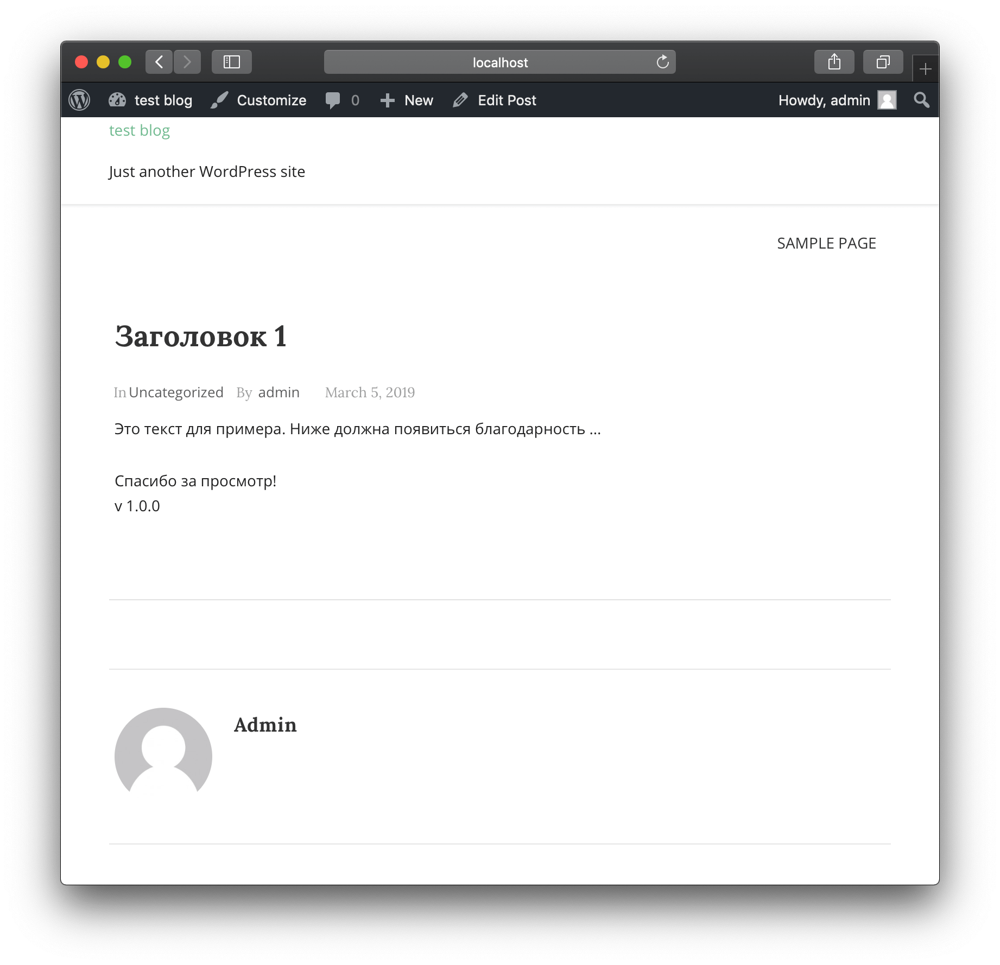
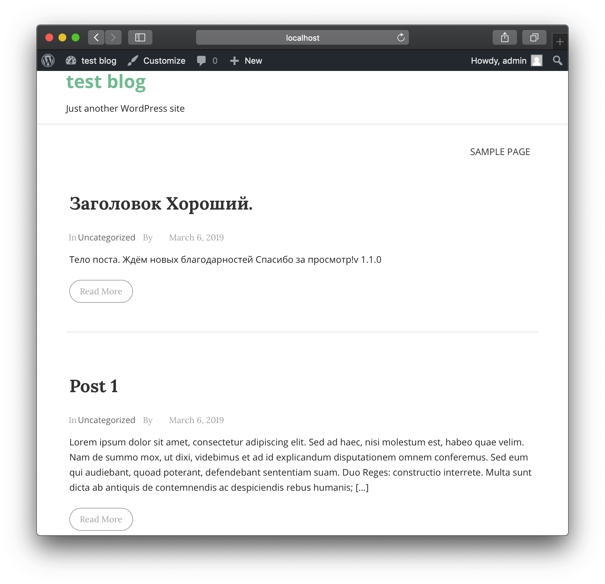

_В этом цикле статей я хочу описать построение [ процесса Continuous Integration/Continuous Delivery ](/2018/03/18/ideal-ci-cd.html) на конкретных примерах и аргументирую выбор того или иного решения._
<!--more-->

## Ещё один взгляд на Continuous Integration(CI)

Весь процесс CI можно проиллюстрировать следующей картинкой:



Со стороны разработки это выглядит так: написали фичу, пушнули в GitHub, прошли ревью, тесты, собирается артефакт, затем деплоится на тестовый сервер. Потом после дополнительных тестов идёт в продакшн.

Я предлагаю взглянуть на это с ***другой*** стороны, а именно того, кто настраивает эти процессы(ещё называется build pipeline). Обычно такой настройкой занимаются _билд-инжинеры_(build engineers), иногда есть даже _девопс инжинеры_(DevOps engineers), а в случае небольшой команды эту роль может выполнять один из разработчиков, тот, кто лучше всех знает.

По легенде наша команда, состоящая из двух разработчиков, одного тестировщика и одного менеджера, занимается доработкой блога на Wordpress(пишет плагины). 

Wordpress был выбран по нескольким причинам: 

- [самая популярная платформа по созданию сайтов](https://www.google.com/search?q=самые+расространенные+cms)

- написан на php, поэтому не нужно компилировать. Изменения можно увидеть сразу на сайте

Сегодня мы остановимся на первом этапе *Разработка*, для обеспечения его нам нужно сделать следующее:

1. Настройка локального рабочего окружения.

1. Собрать все изменения в центральный репозиторий системы контроля версий(например GitHub)

## Настройка локального рабочего окружения

Нетерпеливым оставляю [ссылку на репозиторий](https://github.com/korney4eg/thank-after-post/tree/1.0.0), остальных приглашаю читать дальше.

### Создаём необходимые файлы и папки

Создадим папку `wp`, в которой будет храниться код вордпресса и все дополнительные файлы.

```bash
$ mkdir wp
```

Создадим папку, для плагина, над которым будет работать наша команда.

```bash
$ mkdir thank-after-post
```

Теперь создаём плагин `thank-after-post` в файле `thank-after-post/thank-after-post-plugin.php`:

```php
<?php
/**
 * Plugin Name: Thank after post plugin
 * Plugin URI: http://www.mywebsite.com/thank-after-post
 * Description: Plugin that adds thank you after all posts
 * Version: 1.0.0
 * Author: Jack Frost
 * Author URI: http://www.mywebsite.com
 */
add_action( 'the_content', 'thank_after_post' );

function thank_after_post ( $content ) {
    return $content .= '<p>Спасибо за просмотр!<br>v 1.0.0</p>';
}
```

В этом плагине мы добавляем надпись ***Спасибо за просмотр!*** после каждого поста. Версию **1.0.0** будем изменять, чтобы моделировать изменения в коде.

Создадим архив для первичной установки плагина:
```bash
$ zip thank-after-post.zip thank-after-post/ -r
```

Создаём скрипт по установке и настройке Wordpress, назовём его `configure-wp.sh`:
```bash
retries=0
while :
do
  if wp core install --url="localhost" --title="test blog" --admin_user="admin" --admin_password="parol" --admin_email="admin@email.com"
  then
    break
  else
    retries=$((retries+1))
    echo "Couldn't connect to DB. Try - ${retries}. Sleeping 10 seconds and will retry ..."
    sleep 10
  fi
  if [ "${retries}" -eq "5" ]
  then
    echo "Something went wrong. Exiting."
    exit 1
  fi
done
wp theme install liana --activate
if [ "$(wp post list|wc -l)" -lt "10" ]
then
  curl http://loripsum.net/api/5 | wp post generate --post_content --count=10
else
  echo "Already got enough posts"
fi
wp plugin uninstall akismet
wp plugin uninstall hello
wp plugin install /opt/thank-after-post.zip
wp plugin activate thank-after-post
```
В этом скрипте активно используется утилита [wp-cli](https://wp-cli.org/). Очень рекомендую всем, кто использует Wordpress.
Несколько пояснений:

1. `wp core install ...` - создаёт и настраивает wordpress. Как видно мы несколько раз пытаемся запустить эту команду, пока она не пройдёт успешно, потому что к тому моменту может ещё не быть приготовлена база данных. Сразу создаём пользователя ***admin*** с паролем ***parol***.

1. Чтобы сайт не казался безлюдным можно сгенерировать 10 постов. Используем команду `wp post generate`.

2. `wp theme install liana` - устанавливаем тему liana

3. `wp plugin uninstall ...` - удаляем плагины

4. `wp plugin install /opt/thank-after-post.zip` - устанавливает плагин из архива, который мы создали раньше. К сожалению без архива `wp` не может найти этот плагин

4. `wp plugin activate thank-after-post` - активируем наш плагин.

### Установка и настройка Wordpress с помощью doker-compose
Я выбрал вариант использовать Docker контейнеры, потому что они позволяют с минимальными усилиями и настройками запускать приложения в любой системе, будь-то Linux, Windows или MacOS. Если система состоит из нескольких контейнеров, то проще всего управлять ими с помощью `docker-compose`.

Для разработки на локальной машине нам не нужен высоконадёжный, масштабируемый сервис, поэтому будет использоваться всего 3 контейнера, как показано на рисунке:



Создаём файл `docker-compose.yaml`, рекомендую почитать [спецификацию](https://docs.docker.com/compose/compose-file/):
```yaml
version: '3'

services:
  mysql:
    image: mysql:8
    command: --default-authentication-plugin=mysql_native_password
    restart: always
    ports:
      - "3306:3306"
    environment:
      MYSQL_ROOT_PASSWORD: root
      MYSQL_DATABASE: wordpress
    networks:
      local:
        aliases:
          - database

  wordpress:
    image: wordpress:5.1-php7.3-apache
    container_name: wordpress
    ports:
      - "80:80"
    environment:
      WORDPRESS_DB_HOST: database
      WORDPRESS_DB_USER: root
      WORDPRESS_DB_PASSWORD: root
      WORDPRESS_DB_NAME: wordpress
    networks:
      - local
    volumes:
      - "./wp:/var/www/html/"
      - "./thank-after-post:/var/www/html/wp-content/plugins/thank-after-post"

  wp-cli:
    image: wordpress:cli
    container_name: wp-cli
    environment:
      WORDPRESS_DB_HOST: database
      WORDPRESS_DB_USER: root
      WORDPRESS_DB_PASSWORD: root
      WORDPRESS_DB_NAME: wordpress
    networks:
      - local
    volumes:
      - "./wp:/var/www/html/"
      - "./thank-after-post.zip:/opt/thank-after-post.zip"
      - "./configure-wp.sh:/opt/configure-wp.sh"
    command: "bash /opt/configure-wp.sh"

networks:
  local:
    driver: bridge
    ipam:
      driver: default
      config:
      -
        subnet: 172.16.238.0/24
```

Несколько пояснений:

#### networks

Настраиваем сеть, в которой будут работать контейнеры.

* driver: ***bridge*** - означает, что будет создана виртуальная компьютерная сеть с ip адресами, *172.16.238.1-254* и в этой сети будут запускаться созданные контейнеры.

#### services


* **mysql**

  1. Сервис базы данных MySQL (используем официальный [docker образ](https://hub.docker.com/_/mysql))

  1. Так как в 8й версии изменился процесс аутентификации по умолчанию, то прописываем старый ***mysql_native_password***.

  1. Если база данных почему-то упадёт, `docker-compose` её поднимет обратно автоматически.

  1. Пользователь: ***root*** (по умолчанию)

  1. Пароль: ***root***

  1. Чтобы можно было подключиться к базе вне контейнера пробросим порт ***3306*** на локальную машину. Теперь сервер баз данных доступен по адресу *localhost:3306*.

  1. Чтобы не подсоединяться к базе данных по ip адресу, прописываем *alias*(псевдоним) в сети, по которому можно обратиться к базе данных ***database*** из других контейнеров.

  1. Используем сеть ***local***, которую создавали выше.

* **wordpress**

  1. Устанавливаем wordpress версии ***5.1*** (используем официальный [docker образ](https://hub.docker.com/_/wordpress)).

  1. Пробрасываем порт ***80*** на локальную машину, чтобы можно было зайти на сайт по адресу [http://localhost](http://localhost).

  1. Прописываем переменные для соединения с базой данных.

  1. Используем сеть ***local***, которую создавали выше.

  1. Подмонтируем две директории:
    * `wp` - создали в предыдущем разделе, в ней будет храниться весь код wordpress, установленные плагины, темы, загруженные файлы.
    * `thank-after-post` - создали в предыдущем разделе, в ней будет храниться код плагина, над которым работает наша доблесная команда

* **wp-cli**(Этот контейнер нужен только для первичной установки и настройки wordpress)

  1. Прописываем переменные для соединения с базой данных.

  1. Используем сеть ***local***, которую создавали выше.

  1. Подмонтируем директорию и два файла:

    * директория `wp` - та же, что и для сервиса ***wordpress***

    * архив `thank-after-post.zip` - архив с плагином (создали в предыдущем разделе)

    * файл `configure-wp.sh` - скрипт, который отвечает за установку и настройку Wordpress(создали в предыдущем разделе)

  1. При старте сервиса запускается скрипт `configure-wp.sh`

> **Внимание!** Перед тем, как запускать `docker-compose` нужно создать все упомянутые выше файлы и директории.

Проверим что всё работает, стартуем сервисы:
```bash
$ docker-compose up -d
Creating network "wordpress_local" with driver "bridge"
Creating wordpress_mysql_1 ... done
Creating wp-cli            ... done
Creating wordpress         ... done
```

Подождём секунд 15 и можно открыть [localhost](http://localhost). Видно что-то такое:



Проверим, что наш плагин работает. [Залогинимся](http://localhost/wp-login.php)(логин: **admin**, пароль: **parol**) и [опубликуем пост](http://localhost/wp-admin/post-new.php).



Нажимаем "Publish" 2 раза и открываем на сайте статью (кнопка "View Post") ...



Как видно, плагин работает как надо!

Давайте проверим, что всё правильно было настроено, и можно вносить изменения в плагин.

Поменяем версию в файле `thank-after-post/thank-after-post-plugin.php` на **1.1.0**.

Теперь нам нужно создать новый пост. В этот раз попробуем добавить не через сайт, а используя wp-cli. Есть команда [wp post create](https://developer.wordpress.org/cli/commands/post/create/), которой можно создавать посты автоматически.

Запускаем:

```bash
$ docker-compose run --rm wp-cli wp post create --post_title='Заголовок хороший.' --post_content='Тело поста. Ждём новых благодарностей' --post_status=publish
Starting wordpress_mysql_1 ... done
Success: Created post 17.
```

Пишет, что пост создался. Зайдём на сайт и проверим ...


Версия правильная, теперь разработчики могут сосредоточиться на разработке функционала.

Чтобы остановить запущенные сервисы, воспользуемся командой:
```bash
$ docker-compose down -v
Stopping wordpress         ... done
Stopping wordpress_mysql_1 ... done
Removing wp-cli            ... done
Removing wordpress         ... done
Removing wordpress_mysql_1 ... done
Removing network wordpress_local
```

## Собираем в центральный репозиторий


Когда всё это работает, добавляем все файлы кроме папки `wp` в репозиторий и пушим на GitHub или любое другое хранилище репозиториев.

Теперь любой член команды может легко настроить у себя такое же окружение просто склонировав репозиторий и запустив `docker-compose`


## TL;TR

Сегодня мы создали окружение для разработки на Wordpress, с которым можно работать всем членам команды и независимо создавать и тестировать фичи. В следующих статьях будем подготавливать остальные этапы, чтобы в итоге построить Continuous Integration, затем и Continuous Delivery.

Пример с вордпрессом я взял из головы, просто для иллюстрации. Если вы у себя используете Wordpress, напишите, как это происходит у вас в команде и какие этапы вы используете, какие игнорируете.
