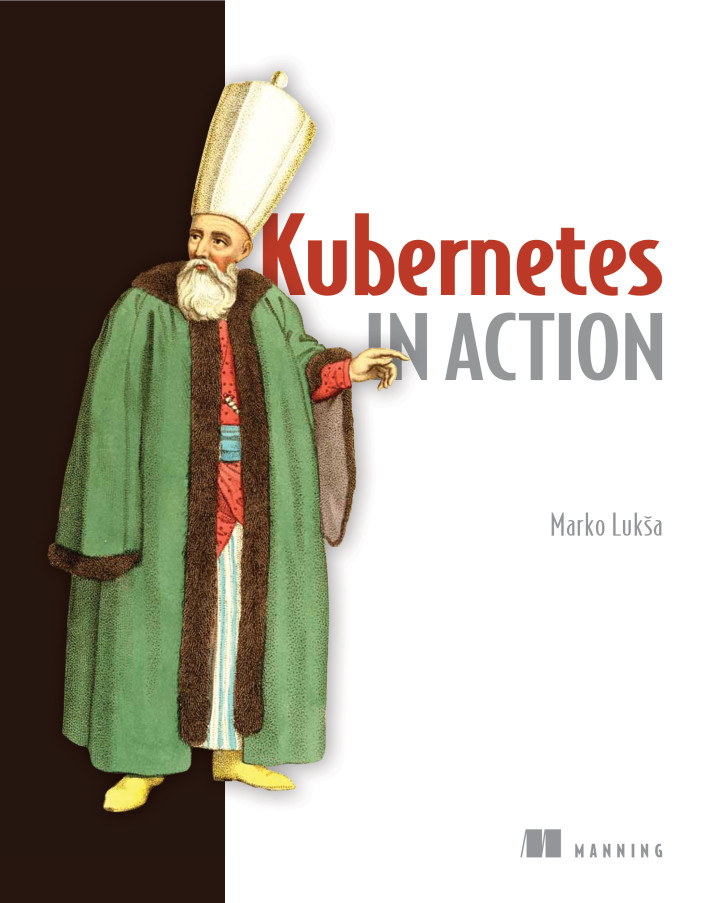

_Я давно приступал к изучению Kubernetes(k8s). Начинал с [katacoda](https://www.katacoda.com/courses/kubernetes), где по сценариям делаешь упражнения. Затем посмотрел серию видео-уроков от [Слёрм](https://habr.com/ru/company/southbridge/blog/419569/), мне видео понравилось, но опять в голове знаний не осталось. В очередной раз начать изучение k8s и взялся с книги ["Kubernetes in Action"](https://www.manning.com/books/kubernetes-in-action) от сотрудника RedHat, работавший над OpenShift. Об этой книге и хочу рассказать._
<!--more-->

## Про книгу.

Книга хорошо структурирована, в ней есть следующие главы:

1. Введение в Kubernetes.
2. Первые шаги в Docker и Kubernetes.
3. Поды: запускаем контейнеры в Kubernetes.
4. Репликации и другие контроллеры: контролируем поды.
5. Сервисы: подключаемся к подам.
6. Подключаем тома(volumes).
7. Конфигурации(ConfigMaps) и секреты(Secrets).
8. Читаем данные подов из приложения.
9. Деплои: обновляем приложение.
10. StatefulSet: деплоим стейтфул приложение.
11. Понимаем внутренности Kubernetes.
12. Безопасность нодов и сетей.
13. Аутентификация и авторизация.
14. Управление вычислительными ресурсами.
15. Автоматическое масштабирование подов и нод.
16. Продвинутое планирование.
17. Лучшие практики.
18. Расширяем Kubernetes.

Мой товарищ на работе только прочитав эту книгу и поделав из неё упражнения сдал на сертификат [CKA](https://www.cncf.io/certification/cka/).

Мне очень понравилась, написана легко и доходчиво. Всем советую.

Сразу скажу, повторно перечитываю эту книгу и делаю упражнения но по своим задумкам. Может быть потом оформлю эти задумки в качестве небольших уроков на этом сайте. Да, знаю, что уже куча литературы и материалов было выпущено по kubernetes, но как известно, лучший способ изучить что-нибудь - это объяснить другим людям.

## Кому книга может не понравиться.

Я думаю, людям кто разбирается в администрированнии и разработке в kubernetes книга ничего полезного может и не дать. Так же обладатели сертификатов [Certified Kubernetes Administrator](https://www.cncf.io/certification/cka/) и [Certified Kubernetes Application Developer ](https://www.cncf.io/certification/ckad/) могут спокойно обойти эту книгу стороной. Всем остальным рекомендую.
