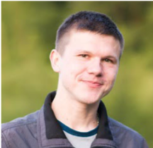

## Об авторе

Привет! Меня зовут Алексей Корнеев.

В IT вошёл в 2009 году как системный администратор, где занимался переустановкой Windows XP и настройкой малых локальных сетей, по-немногу изучал Linux. В 2013 началась движуха с DevOps и спокойно в неё влился, с этого момента продолжаю работать и развиваться в этом направлении.

Работал с облаками:
 - AWS
 - Digital Ocean

Пока по работе не пробовали, дома балуюсь с kubernetes.

Предпочитаю писать на:
 - Golang
 - Ruby
 - Python
 - Bash

Если вы хотите пообщаться со мной на тему одной из статей или просто так, то пишите мне:

e-mail: korneevayu (sobaka) gmail.com,

GitHub: [ korney4eg ](github.com/korney4eg/)

twitter: [ @kornei4 ](https://twitter.com/kornei4)

Телеграмм: [@korney4eg]( https://t.me/korney4eg )

LinkedIn: [aliaksei-karneyeu](https://www.linkedin.com/in/aliaksei-karneyeu-6064a745/)

## Регалии

## О блоге

Этот блог задумывался как выражение идей и мыслей автора, так что вполне возможно, что он будет меняться и перестраиваться.

Главной целью являются:

  - Помочь с проблемой, которую я уже решил

  - То, что мне интересно сохранить

  - Мои мысли и впечатления
