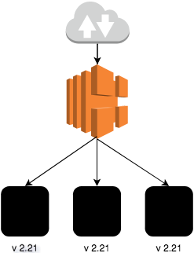
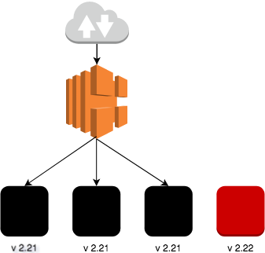
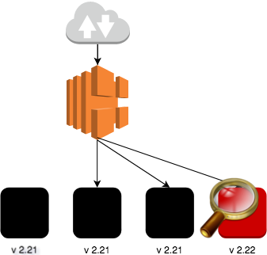
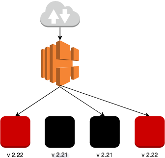
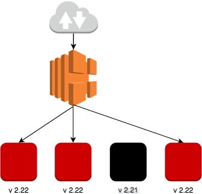

Эта третья и заключительная часть статей, посвящённых zero-downtime deployment ([первая - Blue-Green Deployment](/2018/11/11/blue-green-deployment-with-anisble-with-aws.html), [вторая - Rolling Deployment](/2018/11/18/rolling-deployment-with-anisble-with-aws.html))

На этот раз речь пойдёт о canary deployment(ещё называется canary release, canary testing или по-русски выкатка c канарейкой).
<!--more-->

## Canary Deployment

**Историческая справка:**


Почему называется выкатка c канарейкой.

В давние времена шахтёры, спускались в шахты для добычи полезных ископаемых. В камерах/пещерах мог скапливаться газ, дышать которым было очень небезопасно. Для того, чтобы убедиться, что камера не содержит вредных газов, шахтёры носили с собой клетку с канарейкой. Они и выпускали птицу у входа в камеру. Если канарейка спокойно летала, значит пещера безопасная и можно в ней находиться. Если же в пещере были газы, то вскоре канарейка быстро теряла сознание. Таким образом удавалось избежать человеческих жертв.



Этот принцип используется для деплоя, когда новая версия продукта появляется у очень малого числа пользователей.

Как проходит Canary Deployment:

1. У нас есть несколько инстансов на которых работает приложение версии 2.21 и лоад балансер.<br>

2. Добавляем виртуалку с версией 2.22 и подключаем к балансеру.<br>

3. Отключаем одну старую ноду с версией 2.21 от лоад балансера и удаляем её.<br>

4. Мониторим ноду, когда на неё приходит трафик.<br>

5. Если по прошествии какого-то времени (пару дней или неделя) ничего критичного не случается, заменяем все виртуалки по одной.<br>

6. Если что-нибудь происходит на шаге 4, просто выкатываем ноды с предыдущей версией и отключаем от балансера ноды с более новой версией. Их необязательно удалять, их можно проанализировать и выявить причину сбоя, или заняться повторным тестированием.<br>


Этот вид развёртывания неприемлем, если есть калечащие изменения в базе данных при переходе на новую версию приложения.


## Реализация

В реализации Canary deployment является частным случаем Rolling Deployment, только заменяются не все старые ноды а некоторые(в примере выше только одна). По заверешении тестирования и мониторинга можно продолжить rolling deployment, пока старые ноды не будут заменены.

## Запускаем ansible

Вот [ ссылка ](https://github.com/korney4eg/rolling-deployment-ansible) на полный плейбук.

Проще всего будет клонировать весь репозиторий и запустить скрипт:
```bash
git clone https://github.com/korney4eg/rolling-deployment-ansible
cd rolling-deployment-ansible/
ansible-playbook provision.yaml -e version='2.22' -e instances_num=1 -v
```

ansible-playbook позволяет перезаписывать переменные из командной строки с помощью флага _-e_, дальше идёт имя переменной и её значение. Из примера видно, что будет добавлена одна нода с версией 2.22.

Чтобы всё удалить, выполняем команду:
```bash
ansible-playbook destroy.yaml  -v
```

## A/B Тестирование

По описанию, выкатка c канарейкой очень похожа на A/B тестирование. В принципе так и есть. Только малая часть трафика идёт на ноды с новой версией приложения, и несколько пользователей могут оценить новые фичи. Весь остальной трафик идёт на старые ноды и большинство пользователей разницу не заметят. 

Например в Facebook сначала сами сотрудники получают новую версию программы и работают с ней какое-то время. Затем постепенно выкатывается на все регионы за пределами офисов.

## Заключение

В этих статьях были рассмотрены основные способы непрерывного развёртывания. Какой из них использовать решать вам.
