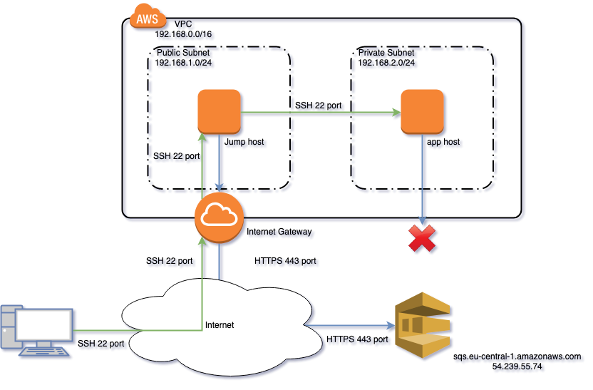

_**Это одна из статей из категории чтобы самому не забыть, и может ещё кому пригодиться.**_

_Иcпользовать инстансы в облаке Amazon с доступом в интернет не всегда возможно или даже просто небезопасно. Для обновления репозиториев или скачивания контейнеров используются внутренние сервисы. Для обращения к какому-нибудь API в интренете поднимают или NAT-gateway, или Proxy-сервер. Если вам нужен один из сервисов AWS, например SQS или S3, то как быть в этом случае? Об этом и будет сегоднящняя статья._  <!--more-->

__**UPDATE 29.05.2020: Код был обновлён, теперь он работает на terraform 0.12.**__

## Теория

### Проблема



В VPC есть две подсети: публичная и приватная. В публичной подсети, с доступом в интернет, будет работать **jump host** - это сервер-переправа. В приватной сети, у которой нет доступа к интернету, работает какой-то сервер приложений(**app server**). Задача состоит в том, чтобы этот сервер мог доступаться до сервиса очередей(Amazon SQS).

Главный затык заключается в том, что адрес SQS в регионе eu-central-1 выглядит так: https://sqs.eu-central-1.amazonaws.com/${Цифры}/${название_очереди}, тоесть это простой URL, доступный по HTTPS и ip-адресу `54.239.55.74`, соответственно **app server** к нему подключиться не может.

Чуть ниже можно будет убедиться, что доступа к сервису очереди сообщений(SQS) из сервера в приватной сети нету, хотя правила фаервола разрешают все соединения. Давайте создадим указанную на схеме инфраструктуру.

### Решение

Как уже упоминалось выше есть несколько путей решения этого вопроса:

1. Поднять NAT-Gateway. Тогда, при правильно настроенной маршрутизации, весь трафик будет идти через этот NAT-gateway и сервер сможет доступаться в интернет. Этот способ не подходит по условию задачи, так как в интернет не должно быть никакого доступа.
2. Proxy-server. Не подходит по той же причине, как и 1.
3. Использовать VPC Endpoint. На нём остановимся подробнее.

Где-то в конце 2017 года Amazon представила новый сервис **VPC Endpoint**, который позволяет привязать к одному из сервисов в AWS Elastic Network Interface и задать секьюрити группу(сам не сильно люблю англицизмы, но в этой ситуации "группа безопасности" режет слух), по которым можно спокойно настроить файервол.

После применения, инфраструктура будет такой:


### Дополнительные сведения

Пока существует два вида VPC Endpoint: Interface VPC Endpoints (AWS PrivateLink) и Gateway VPC Endpoints.

#### Interface VPC Endpoint

Создаёт сетевой интерфейс и привязывает его к одной или нескольким подсетям в VPC. Платить придётся только за дополнительный сетевой интерфейс и трафик.

Может работать с такими сервисами:

- Amazon API Gateway
- AWS CloudFormation
- AWS CloudTrail
- Amazon CloudWatch
- Amazon CloudWatch Events
- Amazon CloudWatch Logs
- AWS CodeBuild
- AWS CodeCommit
- AWS CodePipeline
- AWS Config
- Amazon EC2 API
- Elastic Load Balancing API
- Amazon Elastic Container Registry
- Amazon Elastic Container Service
- AWS Key Management Service
- Amazon Kinesis Data Streams
- Amazon SageMaker and Amazon SageMaker Runtime
- Amazon SageMaker Notebook Instance
- AWS Secrets Manager
- AWS Security Token Service
- AWS Service Catalog
- Amazon SNS
- Amazon SQS
- AWS Systems Manager
- AWS Transfer for SFTP
- Endpoint сервисы из других аккаунтов AWS

#### Gateway VPC Endpoint

Добавляет в таблицу маршрутизации запись перенаправляющую трафик на Gateway вашего сервиса. Дополнительно оплачивается только сетевой трафик.

Работает с сервисами:

- Amazon S3
- DynamoDB

## Практика. Посмотрим на примере

### Создаём VPC, AMI, ключи

Создаём VPC, с диапазоном адресов `192.168.0.0/16` в регионе Frankfurt(eu-central-1).

Добавляем ключ, по которому будем логиниться на сервера.

Находим самый свежий образ виртуальной машины AMI от Amazon, чтобы потом из него создавать сервера.
```cpp
#infra.tf
provider "aws" {
  region  = "eu-central-1"
  profile = "home"
}

resource "aws_vpc" "main" {
  cidr_block           = "192.168.0.0/16"
  enable_dns_support   = true
  enable_dns_hostnames = true
}

resource "aws_key_pair" "deployer" {
  key_name   = "deployer-key"
  public_key = "ssh-rsa AAAAB3Nz...64enaBK0VCWeN"
}

data "aws_ami" "amazon-linux-2" {
  most_recent = true

  filter {
    name   = "name"
    values = ["amzn2-ami-hvm*-x86_64-gp2"]
  }

  owners = ["amazon"] # AWS
}
```

### Создаём публичную подсеть(Public subnet)
Публичная подсеть будет иметь диапазон `192.169.1.0/24`, к ней будет подключён `internet gateway` для соединения с интернетом.

```cpp
#public_subnet.tf
resource "aws_subnet" "public" {
  vpc_id                  = aws_vpc.main.id
  cidr_block              = "192.168.1.0/24"
  map_public_ip_on_launch = "true"

  tags = {
    Name = "PublicSubnet"
  }
}

resource "aws_internet_gateway" "gw" {
  vpc_id = aws_vpc.main.id
}

resource "aws_route_table" "route_table_public" {
  vpc_id = aws_vpc.main.id

  route {
    cidr_block = "0.0.0.0/0"
    gateway_id = aws_internet_gateway.gw.id
  }

  tags = {
    Name = "main"
  }
}

resource "aws_route_table_association" "associate_public_subnet" {
  subnet_id      = aws_subnet.public.id
  route_table_id = aws_route_table.route_table_public.id
}
```

### Добавляем Jump server

Сервер-переправа, через него ничего нельзя делать кроме как соединяться с другими серверами из приватной сети. Обычно там есть только ssh, но для нашего примера на нём будет установлен `aws cli`, будем пробовать подключиться к SQS.

К этому серверу открываем входящий трафик на порт 22, и позволяем весь исходящий трафик.

Чтобы можно было доступаться до очереди сообщений не храня ключей, назначим серверу профиль, с нужными правами(их создадим позже).

```cpp
#jump_host.tf
resource "aws_security_group" "jump_sg" {
  name        = "in_ssh_all_out_all"
  description = "Allow incoming SSH and all outgoing"
  vpc_id      = aws_vpc.main.id

  ingress {
    from_port   = 22
    to_port     = 22
    protocol    = "tcp"
    cidr_blocks = ["0.0.0.0/0"]
  }

  egress {
    from_port   = 0
    to_port     = 0
    protocol    = "-1"
    cidr_blocks = ["0.0.0.0/0"]
  }
}

resource "aws_instance" "jump" {
  ami                         = data.aws_ami.amazon-linux-2.id
  instance_type               = "t2.micro"
  subnet_id                   = aws_subnet.public.id
  key_name                    = "deployer-key"
  vpc_security_group_ids      = [aws_security_group.jump_sg.id]
  associate_public_ip_address = true
  depends_on                  = [aws_internet_gateway.gw]
  iam_instance_profile        = aws_iam_instance_profile.sqs_instance_profile.name

  tags = {
    Name = "Public"
  }
}
```
### Поднимаем приватную подсеть(Private Subnet)
В приватной подсети и будет запускаться сервер с приложением.

```cpp
#private_subnet.tf
resource "aws_subnet" "private" {
  vpc_id     = aws_vpc.main.id
  cidr_block = "192.168.2.0/24"

  tags = {
    Name = "PrivateSubnet"
  }
}
```

### Создаём сервер приложения
Файервол настраиваем почти такой же, как и для **jump server**, разве что соединиться по ssh можно только с **jump server**. Все исходящие соединения разрешены для демонстрационных целей, обычно они тоже ограничены.

Подключаем профиль инстации для доступа к очереди сообщений.
```cpp
#app_instance.tf
resource "aws_security_group" "app_sg" {
  name        = "in_ssh_out_all"
  description = "Allow incoming SSH from Jump host and all outgoing to subnet"
  vpc_id      = aws_vpc.main.id

  ingress {
    from_port       = 22
    to_port         = 22
    protocol        = "tcp"
    security_groups = [aws_security_group.jump_sg.id]
  }

  egress {
    from_port   = 0
    to_port     = 0
    protocol    = "-1"
    cidr_blocks = ["0.0.0.0/0"]
  }
}

resource "aws_instance" "app" {
  ami                    = data.aws_ami.amazon-linux-2.id
  instance_type          = "t2.micro"
  subnet_id              = aws_subnet.private.id
  key_name               = "deployer-key"
  vpc_security_group_ids = [aws_security_group.app_sg.id]
  iam_instance_profile   = aws_iam_instance_profile.sqs_instance_profile.name

  tags = {
    Name = "Private"
  }
}
```

### Создаём очередь сообщений
Создаём очередь сообщений `makvaz_queue`.

Создаём роль для доступа к очереди и подключаем её к профилю инстанции(instance profile), этот профиль мы подключили к серверу приложений выше.
```cpp
#sqs.tf
resource "aws_sqs_queue" "queue" {
  name = "makvaz_queue"

  tags = {
    Environment = "dev"
  }
}

resource "aws_iam_role" "ec2_sqs_access_role" {
  name = "sqs-role"

  assume_role_policy = <<EOF
{
 "Version": "2012-10-17",
 "Statement": [
   {
     "Action": "sts:AssumeRole",
     "Principal": {
       "Service": "ec2.amazonaws.com"
     },
     "Effect": "Allow",
     "Sid": ""
   }
 ]
}
EOF

}

resource "aws_iam_policy" "sqs_policy" {
  name        = "sqs-policy"
  description = "sqs policy"

  policy = <<EOF
{
  "Version": "2012-10-17",
  "Statement": [
    {
      "Effect": "Allow",
      "Action": "sqs:*",
      "Resource": "*"
    }
  ]
}
EOF

}

resource "aws_iam_policy_attachment" "attach_sqs_policy" {
  name       = "attach_sqs_policy"
  roles      = [aws_iam_role.ec2_sqs_access_role.name]
  policy_arn = aws_iam_policy.sqs_policy.arn
}

resource "aws_iam_instance_profile" "sqs_instance_profile" {
  name = "sqs_instance_profile"
  role = aws_iam_role.ec2_sqs_access_role.name
}
```

### Добавляем вывод результатов

В Terraform можно добавить вывод нужных параметров.

Мы будем выводить ip адреса серверов и URL очереди сообщений.


**UPD 03.05.2019:** Как правильно заметил [alexandrlomov](http://disq.us/p/21k3dto) в outputs переменные не должны содержать пробелов, чтобы их можно было использовать из другого модуля.

 

Нашёл [соглашение об именовании переменных и ресурсов в terraform](https://www.terraform-best-practices.com/naming), если коротко, то переменные задаются маленькими буквами с подчёркиванниями, без тире и пробелов.


```cpp
#output.tf
output "jump ip" {
  value = aws_instance.jump.public_ip
}

output "app instance ip" {
  value = aws_instance.app.private_ip
}

output "SQS url" {
  value = aws_sqs_queue.queue.id
}
```

### Запускаем

```bash
$ terraform apply --auto-approve

...

aws_instance.app: Still creating... (20s elapsed)
aws_instance.jump: Creation complete after 23s (ID: i-0458e032e501d26c5)
aws_instance.app: Still creating... (30s elapsed)
aws_instance.app: Creation complete after 38s (ID: i-0083d9691439ea7a6)

Apply complete! Resources: 16 added, 0 changed, 0 destroyed.

Outputs:

sqs_url = https://sqs.eu-central-1.amazonaws.com/439502331296/makvaz_queue
app_instance_ip = 192.168.2.213
jump_ip = 3.122.103.200
```

Подключаемся к **jump server** и пробуем отправить сообщений.

```bash
$ ssh  ec2-user@3.122.103.200 -A
The authenticity of host '3.122.103.200 (3.122.103.200)' can't be established.
ECDSA key fingerprint is SHA256:s0gLEdb/H3sAFgSDCp/ZsvMvivXrPTxJXqKpNTAU2gA.
Are you sure you want to continue connecting (yes/no)? yes
Warning: Permanently added '3.122.103.200' (ECDSA) to the list of known hosts.

       __|  __|_  )
       _|  (     /   Amazon Linux 2 AMI
      ___|\___|___|

https://aws.amazon.com/amazon-linux-2/
1 package(s) needed for security, out of 3 available
Run "sudo yum update" to apply all updates.
[ec2-user@ip-192-168-1-212 ~]$ aws sqs send-message --queue-url https://sqs.eu-central-1.amazonaws.com/439502331296/makvaz_queue --message-body "Тестовое сообщение" --region eu-central-1
{
    "MD5OfMessageBody": "5e3d5c58fa308ad3fc40c94d4f9c79d2",
    "MessageId": "ff73cdcc-b73b-4d8b-9836-e60d176e1b8f"
}
```

Переходим на сервер приложений

```bash
[ec2-user@ip-192-168-1-212 ~]$ ssh 192.168.2.213
The authenticity of host '192.168.2.213 (192.168.2.213)' can't be established.
ECDSA key fingerprint is SHA256:t7tw2jgM02Po1I/2wmKZiu7Hw5B2W8egl3ujFtYExC4.
ECDSA key fingerprint is MD5:19:ac:7f:0f:cf:dd:a9:65:44:29:b5:a7:14:6c:34:b4.
Are you sure you want to continue connecting (yes/no)? yes
Warning: Permanently added '192.168.2.213' (ECDSA) to the list of known hosts.

       __|  __|_  )
       _|  (     /   Amazon Linux 2 AMI
      ___|\___|___|

https://aws.amazon.com/amazon-linux-2/
[ec2-user@ip-192-168-2-213 ~]$ aws sqs receive-message --queue-url https://sqs.eu-central-1.amazonaws.com/439502331296/makvaz_queue  --region eu-central-1

^C
```

Видно что не может подсоединиться и завис до наступления таймаута. Попробуем пингануть

```bash
[ec2-user@ip-192-168-2-213 ~]$ ping sqs.eu-central-1.amazonaws.com
PING sqs.eu-central-1.amazonaws.com (54.239.55.74) 56(84) bytes of data.
^C
--- sqs.eu-central-1.amazonaws.com ping statistics ---
2 packets transmitted, 0 received, 100% packet loss, time 1006ms
```

Пинг тоже не проходит, хотя мы знаем ip адрес. Запомним его, он нам пригодиться в будущем.

Уходим обратно на **jump server** и пробуем прочитать сообщений из очереди.
```bash
[ec2-user@ip-192-168-2-213 ~]$ exit
logout
Connection to 192.168.2.213 closed.
[ec2-user@ip-192-168-1-212 ~]$ aws sqs receive-message --queue-url https://sqs.eu-central-1.amazonaws.com/439502331296/makvaz_queue  --region eu-central-1
{
    "Messages": [
        {
            "Body": "Тестовое сообщение",
            "ReceiptHandle": "AQEBHof+reULBQ35SaDKWdpXByMkTV5LxJUloPv9jtbmOXmc10Q7GfEiE3sq0Btfc0GZuRvPr5w3rabdYQV38qfqtLJqvpCjRkXA93epo2WG+B4oz/z4V4vVf2i52Vd+/HBhajCvU/RuaB/su7jbL3aA5qZEF7aKfVr7Sj1TN9DoZu7nw+SepMqsTRPIBCN9D5Ph1kclH1I2Mgx/krRNbhPhhVoDDf4E5Ky8jO1rYNsVcXdTaeZFyuQPJJQ7nXxe3xo1d7uemPMRnbeJj6Gfb7xlhnGcJiKt+HP6JWuSDpBouru/SZ3en5OrnLIQscTDgR3dYsJ/Fb+1zPYLDBygk3ZBOVmjVPm2sm3UHCXvQrNqQkn5wN7CPA/W8Jz24aFuI9efRrXvPkzaviOnQfsy4MBFkg==",
            "MD5OfBody": "5e3d5c58fa308ad3fc40c94d4f9c79d2",
            "MessageId": "ff73cdcc-b73b-4d8b-9836-e60d176e1b8f"
        }
    ]
}
```

Видим, что "Тестовое сообщение" вернулось в целости и сохранности.

### Подключаем VPC Endpoint к AWS SQS

Здесь будет создан vpc endpoint и создана группа дающая доступ к этому эндпоинту.

```cpp
#vpce.tf
data "aws_vpc_endpoint_service" "test-queue-vpce-service" {
  service = "sqs"
}

resource "aws_vpc_endpoint" "test-queue-vpce" {
  vpc_id              = aws_vpc.main.id
  service_name        = data.aws_vpc_endpoint_service.test-queue-vpce-service.service_name
  vpc_endpoint_type   = "Interface"
  security_group_ids  = [aws_security_group.sqs_sg.id]
  subnet_ids          = [aws_subnet.private.id]
  private_dns_enabled = "true"
}

resource "aws_security_group" "sqs_sg" {
  name        = "sqs_sg"
  description = "Allow incoming connection to SQS from app server"
  vpc_id      = aws_vpc.main.id

  ingress {
    from_port       = 443
    to_port         = 443
    protocol        = "tcp"
    security_groups = [aws_security_group.app_sg.id]
  }
}
```

### Пробуем

```bash
[ec2-user@ip-192-168-1-212 ~]$ ssh 192.168.2.213
Last login: Sat Apr 13 23:00:44 2019 from ip-192-168-1-212.eu-central-1.compute.internal

       __|  __|_  )
       _|  (     /   Amazon Linux 2 AMI
      ___|\___|___|

https://aws.amazon.com/amazon-linux-2/
[ec2-user@ip-192-168-2-213 ~]$ ping sqs.eu-central-1.amazonaws.com
PING sqs.eu-central-1.amazonaws.com (192.168.2.242) 56(84) bytes of data.
^C
--- sqs.eu-central-1.amazonaws.com ping statistics ---
3 packets transmitted, 0 received, 100% packet loss, time 2039ms

```

Видно, что ip адрес поменялся и стал из диапазона внутренней сети.

Попробуем отправить и принять сообщение 

```bash
[ec2-user@ip-192-168-2-213 ~]$ aws sqs send-message --queue-url https://sqs.eu-central-1.amazonaws.com/439502331296/makvaz_queue --message-body "Тесто
вое сообщение изнутри" --region eu-central-1
{
    "MD5OfMessageBody": "fa2c7b1632115ad4fe27cc392f819514",
    "MessageId": "fd6a6c5f-58b3-4a6c-8d6b-7c6525190e16"
}
[ec2-user@ip-192-168-2-213 ~]$ aws sqs receive-message --queue-url https://sqs.eu-central-1.amazonaws.com/439502331296/makvaz_queue  --region eu-central-1
{
    "Messages": [
        {
            "Body": "Тесто\nвое сообщение изнутри",
            "ReceiptHandle": "AQEBiKXbTmlRaWKIH+q/LRLyljXowT11L78+wXG8XHx7vQeE22vwfDpEdkitiRSHsqaluLp/HHkiWjzLb3usnyStBOmTP8yC2YXwYCS1t9qooA1WqtWHET4XC8zV820/wCcgzHYepjdeQjFB67sf/BN3pMYeVjIeLAuL07Pm8WRBgUvmMIkiWtlLWgP0DAVKAoZcPlmM5vXwM1sBnRYJoNQtBVsMX052zUmB38JdCo9uoXWquEAhNXfrxC9YPFMuBguVmuSjZpEb8nqR9dRSNG8uKBDDuZk4W9UKs6cSX6RB+WyEHV+YMyUiffTDzEsFnwG+sA52qcsVIThgs1etOPTd9ASf0WbFGBenyQ/HewW9UDfJEsSNlEhjOoYBiSRJf/T9ImuLV7LBvXGoCLEzOd0J2w==",
            "MD5OfBody": "fa2c7b1632115ad4fe27cc392f819514",
            "MessageId": "fd6a6c5f-58b3-4a6c-8d6b-7c6525190e16"
        }
    ]
}
```

## Полезные ссылки
- [Документация по VPC Endpoint](https://docs.aws.amazon.com/en_us/vpc/latest/userguide/vpc-endpoints.html)
- [Подробнее про Interface VPC Endpoint](https://docs.aws.amazon.com/en_us/vpc/latest/userguide/vpce-interface.html)
- [Подробнее про Gateway VPC Endpoint](https://docs.aws.amazon.com/en_us/vpc/latest/userguide/vpce-gateway.html)
- [Блог амазона по VPC Endpoint](https://aws.amazon.com/ru/blogs/aws/aws-privatelink-update-vpc-endpoints-for-your-own-applications-services/)
