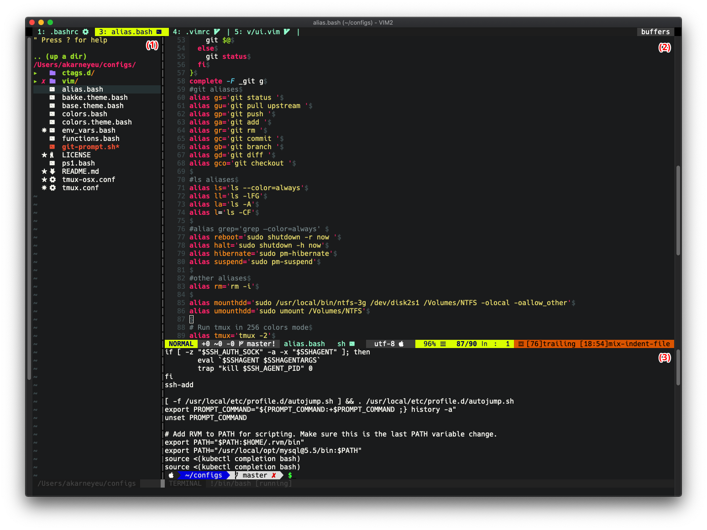
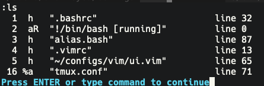
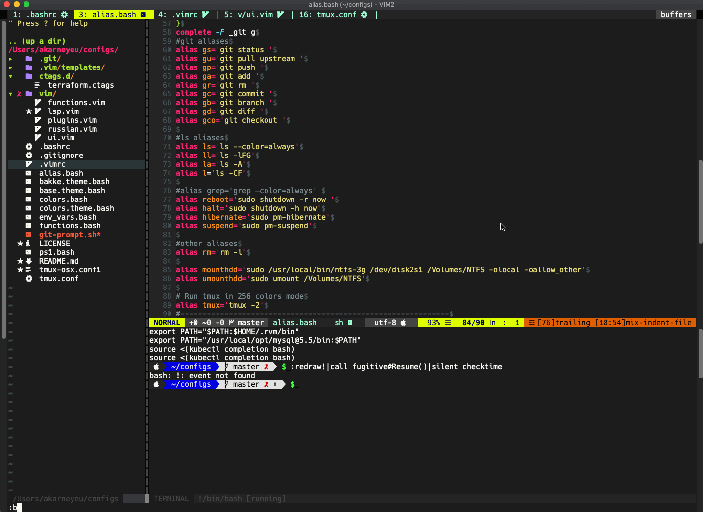
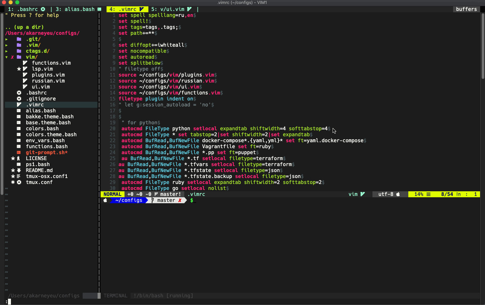

_Vim у меня в хозяйстве используется уже больше 5 лет, иногда возвращался к другим IDE, но в итоге переходил обратно. Сегодня хочу показать, как быстро переключаться между открытыми файлами._
<!--more-->
> **Внимание**
> 
> Предполагается, что читатель уже знаком с режимами работы Vim(Нормальный режим, Режим вставки и Визуальный режим). Если нет - рекомендую пройти обучение(в отдельном терминале набираем vimtutor и проходим, занимает минут 15-20).

У меня Vim сейчас выглядит примерно так: **(1)** дерево файлов, **(2)** открытый файл и **(3)** терминал.



Уже выглядит симпатично, правда? 

> **Справка**
>
> Любой файл, открытый в Vim, терминал, дерево файлов, окно ошибок или любая другая информация помещается в буфер, соответственно у каждого открытого файла есть свой, у терминала - свой. Ближе всего аналогия с вкладками в браузере, в каждой вкладке - свой сайт.
>
> Области **(1)**,**(2)** и **(3)** в Vim называются - окна **(windows)**, они позволяют удобно расположить буферы.

Стоит задача быстро переключаться между открытыми файлами(буферами) в окне (2).

Получить список всех открытых буферов
---

Список всех открытых буферов можно получить, если ввести в нормальном режиме команду `:ls`. Получиться что-то такое.

> **Справка**
>
> Для ввода команды нужно войти в нормальный режим (по клавише Esc), потом просто вводим команду и нажимаем Enter. Команды появляются слева внизу.



Первая колонка - это номер буфера, вторая - имя. Под номером 1 открыт файл `.bashrc`, у файла `alias.bash` номер буфера 3, а у терминала - 2.

У меня установлен плагин, который показывает сверху имена открытых буферов, как вкладки в браузере, что очень удобно. (Ссылка на плагин в конце статьи)


Переключаем с помощью номера буфера.
----

Быстрый и "родной"(нативный) способ для Vim - это ввести команду `:b 1`. Команда `:b` или полная версия `:buffer` говорит Виму открыть буфер, а `1` - это номер буфера из списка. Если мы хотим открыть `.vimrc`, вводим команду `:b 4`. Можно вводить даже без пробела, то есть будет `:b4`. Попробуем переключиться сначала в `.bashrc`, потом в `.vimrc` и возвращаемся в `alias.bash`.



**Плюсы:**
* Короткая команда - быстро набирается

**Минусы:**
* Нужно знать номера буферов. Когда их 5 - это несложно, но когда будет 20 - уже труднее.


Переключаем с помощью имени буфера.
----

Этот способ не такой быстрый, как предыдущий, но очень помогает, когда открыто много файлов.

Команда `:b ` позволяет переключаться ещё и по имени файла, достаточно ввести уникальное имя и нажать *Enter*. Например, попробуем переключить на файл `.bashrc`, для этого можно ввести `:b bashr` и нажать *Enter*. Если ввести не уникальное имя, то Vim ругнётся, что имя не уникальное.

Главнейшая супер-фишка переключения через имя файла(буфера) - работает автодополнение по нажатию *Tab*. Попробуем ввести команду `:b ui` и нажмём *Tab*, открылся файл `vim/ui.vim`.


Если ввести не уникальное имя и нажимать Tab несколько раз, редактор начнёт предлагать по очереди все соответствующие названия буферов.

**Плюсы:**
* Автодополнение имён файлов
* Короткая команда

**Минусы:**
* Не всегда работает так, как нужно
* Нужно знать имя файла


Быстрое переключение между двумя буферами.
----

Когда редактируем только два файла, быстрее переключать используя сочетание клавиш `Ctrl+6`.

Попробуем переключить между `alias.bash` и `vim/ui.vim`.


**Плюсы:**
* Ещё быстрее переключается
* Не нужно вводить никаких команд

**Минусы:**
* Переключаемся только между 2мя файлами, если 

Переключение буферов по-кругу.
----

В браузере (например в Google Chrome или Mozilla Firefox) можно быстро переключаться между вкладками с помощью сочетания клавиш Ctrl+Tab и Ctrl+Shift+Tab.

Для такого же переключения на следующий/предыдущий буфер есть команды vim `:bnext`/`:bprevious`. Давайте назначим сочетаниям клавиш Ctrl+Tab команду `:bnext` для переключения к следующему буферу, а на Ctrl+Shift+Tab - `:bprevious`. Вводим команды:

```vim
:nnoremap <C-Tab> :bnext<CR>
:nnoremap <C-S-Tab> :bprevious<CR>
```

`<CR>` - соответствует нажатию Enter



Всё хорошо работает до того момента, как переключения в буфер терминала, из которого также быстро не получиться переключиться. Как было написано выше, в Vim в буферах открываются не только файлы, но и терминал и список файлов и многое другое.

Попробуем написать несколько более "умных" функций, которая будет позволять переключаться только между файлами.

Первое что нужно сделать, это научиться определять в буфере с указанным номером(index) файл или что-то другое.

```vim
function! IsValidBuffer(index)
    return !empty(bufname(a:index)) && empty(getbufvar(a:index, '&buftype'))
endfunction
```

Буфер должен соответствовать следующим условиям:
1. `!empty(bufname(a:index))` - проверяем, чтобы название буфера не было пустым
2. `empty(getbufvar(a:index, '&buftype'))` - проверяем, что переменная `&buftype` в нужном буфере пустая. У терминала, например она будет `terminal`

Теперь напишем функцию, которая будет находить следующий буфер и определять, является ли буфер файлом, с помощью функции выше.

```vim
function! NextBuffer()
  let ind = bufnr()
  let ind += 1
  while ind != bufnr()
    if ind > bufnr('$')
      let ind = 1
    endif
    if IsValidBuffer(ind)
      break
    else
      let ind += 1
    endif
  endwhile
  execute "buffer" ind
endfunction
```

В этой функции делаем:
1. В переменную `ind` задаём номер текущего буфера
2. Увеличиваем `ind` на 1, пока мы обратно не дойдём до изначального буфера. Если дойдём до крайнего буфера, переходим в индекс 1
3. Для каждого индекса определяем, правильный ли буфер или нет. Если правильный, то выходим и переходим в него.

Точно так же добавим функцию для переключения в обратном направлении:

```vim
function! PreviousBuffer()
  let ind = bufnr()
  let ind -= 1
  while ind != bufnr('')
    if ind < 1
      let ind = bufnr('$')
    endif
    if IsValidBuffer(ind)
      break
    else
      let ind -= 1
    endif
  endwhile
  execute "buffer" ind
endfunction
```

Теперь назначим клавиши на эти функции:
```vim
:nnoremap <C-Tab>  :call NextBuffer()<CR>
:nnoremap <C-S-Tab> :call PreviousBuffer()<CR>
```

Команда `:call` вызывает нашу функцию.

**Плюсы:**
* Ещё быстрее переключается
* Не нужно вводить никаких команд

Полезные ссылки
----
* Плагин для отображения названий файлов сверху(как вкладки) - https://github.com/vim-airline/vim-airline
* Плагин для более глубокой работы с буферами - https://github.com/jlanzarotta/bufexplorer

Послесловие
----
Спасибо, что дочитали до самого конца. Надеюсь этот текст помог чуть больше разобраться с Vim.
