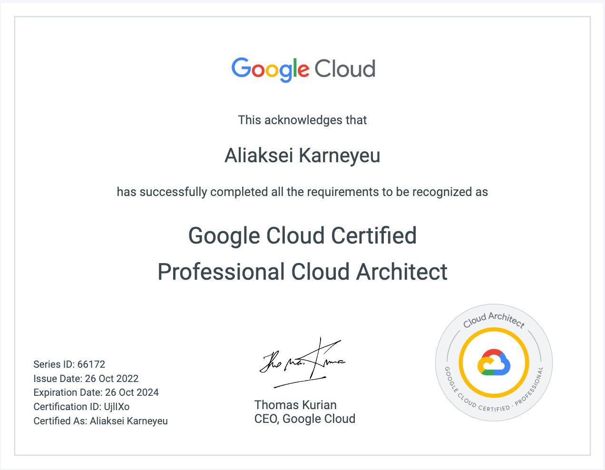

_В понедельник 24 октября 2022 года я сдал экзамен и получил сертификат "Google Cloud Professional Architect" и в этой заметке расскажу, как готовился, что бы посоветовал себе из прошлого и пару мыслей по поводу экзаменов такого типа._
<!--more-->

> **TL;DR: как мне кажется,  к этому экзамену легче готовиться - без опыта работы с GCP, тогда можно спокойно довериться курсам и заучивать ответы на вопросы. В моём случае, практический опыт иногда противоречил ответам, которые предоставлялись как правильные. Тем не менее, подготовка даст знания по работе с облаком Google.**

Я уже до этого сдавал экзамены по сертификациям: [AWS Certified SysOps Administrator - Associate](/2018/08/25/aws-certification-preparation/)(действителен апреля 2021), [Certified Kubernetes Administrator](https://www.credly.com/badges/d20e7506-e328-48fa-b148-730cf3532878/linked_in_profile)(действителен до мая 2023) и AWS Certified Solutions Architect - Associate (действителен до июля 2020).

И вот наконец ещё один:

## Как готовился
Сразу предупреждаю, что раз экзамен на английском, то и материалы по подготовке тоже на этом языке.

### Курс на Udemy "Google Cloud Professional Architect: Get Certified 2022"

[ссылка на курс](https://www.udemy.com/course/google-cloud-professional-architect-get-certified/)

**Плюсы**:
* видео-лекции объясняют с нуля, что лучше подойдёт для новичков в облаке Google(Google Cloud Platform)
* тем, кто уже работал с GCP, поможет разложить знания по полочкам и добавит новых
* на Udemy курсы периодически продаются со скидкой по цене 10$, например на чёрную пятницу

**Минусы**:
* курс не покрывает все темы и технологии, так что использовать только его как единственный источник к подготовке - не советую
* полный практический тест только один на 50 вопросов, и этого не достаточно чтобы потренироваться к экзамену

**Вывод**:
Рекомендую этот курс для людей, начинающих своё путешествие в GCP

### тесты по "Google Cloud Certified Professional Cloud Architect" whizlabs

[ссылка на полный курс](https://www.whizlabs.com/google-cloud-certified-professional-cloud-architect/)

Этот курс я обнаружил за неделю до самого экзамена, поэтому оплатил только дампы тестов и не проверял видео лекции и практические работы.

**Плюсы**:
* вопросы такие же, как на экзамене
* вопросов более 300
* вопросы разбиты по категорям, и  отдельно есть 5 наборов по 50 штук, что позволяет почувствовать себя как на экзамене

**Минусы**:
* вроде и не было

**Вывод**:
Вопросы на тестах похожи на те, что на экзамене, поэтому я их рекомендую всем. Наверное стоит взять и лекции с практическими работами, если кто пробовал, дайте знать.

## Советы себе из прошлого
Самый главный - это делать конспекты по видео из курсов, а не смотреть как сериалы на Netflix. Даже после просмотра курсов не мог сказать в чём разница между некоторыми сервисами, с которыми не работал.
Ещё, наверное, сразу попробовать пройти пару тестов и только потом смотреть видео, тогда будет дополнительная мотивация смотреть курсы внимательнее.

Спасибо всем, кто дочитал до этого места.

## Мысли о подобных экзаменах

Мне жудко не нравится подобный вид экзаменов, которые призваны не проверить знания, а скорее способность проходить сами такие тесты. Какой экзамен понравился - это  "Certified Kubernetes Administrator" - ни какой теории, только кансоль и кубернетисы.

А какие у вас самые классные и самые нелюбимые экзамены?
