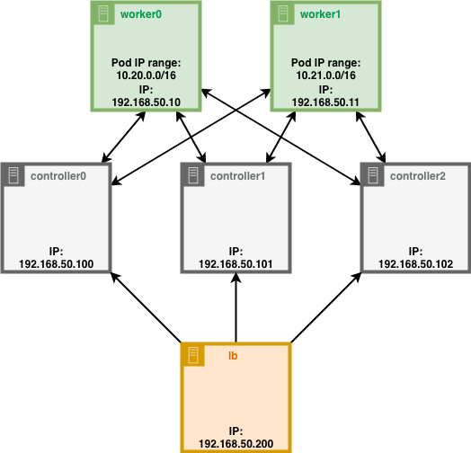

_Давно мечтал развернуть кластер Kubernetes(или k8s) у себя на ноутбуке. Этим хотел понять как этот кластер работает. Когда искал информацию по этой теме, то нашёл только [инструкцию Kelsey Hightower под названием "Kubernetes The Hard Way"](https://github.com/kelseyhightower/kubernetes-the-hard-way)(**KTHW**) на английском языке. Не нашёл ничего подходящего и решил написать пошаговую инструкцию, как запустить кластер kubernetes на ноутбуке._

_Эти знание мне потом помогли сдать экзамен Certified Kubernetes Administrator(CKA)_

_Материал получился большим, поэтому я разделил на несколько частей._
<!--more-->


Перед продолжением рекомендую почитать о [концепциях Kubernetes(на английском)](https://kubernetes.io/docs/concepts/architecture/), тогда эти посты будут ещё понятнее. Тем не менее, если возникнут вопросы, пишите в комментариях - обсудим.


## Содержимое:

1. [Введение. Схема устройства кластера. Подготовка рабочей среды.](#)
2. [Установка и настройка Vagrant, VirtualBox. Создание виртуальных машин.](/2020/08/10/klaster-kubernetes-na-noutbuke-vagrant-virtualbox/)
4. Создание файлов конфигураций, сертификатов.
5. Установка и настройка `etcd`. Запуск Панели управления Kubernetes(Kubernetes Control Plane)
7. Настройка рабочих нод
8. Настройка kubectl, установка плагинов и аддонов. Проверка работоспособности.


## Схема устройства кластера.



> **worker0**, **worker1** - ноды, на которых будут запускаться контейнеры.
> 
> **controller0**, **controller1**, **controller2** - Панель управления Kubernetes. Место хранения информации о кластере, можно назвать центр управления.
> 
> **lb** - балансировщик нагрузки. Все обращения к панели управления идут через него.

При такой структуре можно не только запустить кластер на ноутбуке, но и поиграться с доступностью сервиса, если любая виртуалка упадёт.

Ip-адреса (192.168.50.*) - это адреса, по которым соединяемся с нужной виртуальной машиной.


## Подготовка рабочего окружения на ноутбуке.

Перед тем как настраивать виртуальные машины, сперва установим кое-какие программы на ноутбук.

### kubectl

Клиент, позволяет работать с кластером Kubernetes.

##### Установка на MacOS

```bash
brew install kubectl
```

##### Установка Linux

```bash
curl -LO https://storage.googleapis.com/kubernetes-release/release/`curl -s https://storage.googleapis.com/kubernetes-release/release/stable.txt`/bin/linux/amd64/kubectl
chmod +x ./kubectl
sudo mv ./kubectl /usr/local/bin/kubectl
```

#### Проверяем, что работает

```bash
kubectl version
```

В результате будет что-нибудь такое:
```bash
Client Version: version.Info{Major:"1", Minor:"18", GitVersion:"v1.18.3", GitCommit:"2e7996e3e2712684bc73f0dec0200d64eec7fe40", GitTreeState:"clean", BuildDate:"2020-05-21T14:51:23Z", GoVersion:"go1.14.3", Compiler:"gc", Platform:"darwin/amd64"}
```
### cfssl
Программа для генерирования сертификатов.

##### Установка на MacOS

```bash
curl -LO https://pkg.cfssl.org/R1.2/cfssl_darwin-amd64
chmod +x cfssl_darwin-amd64
sudo mv cfssl_darwin-amd64 /usr/local/bin/cfssl
```
##### Установка Linux

```bash
curl -LO https://pkg.cfssl.org/R1.2/cfssl_linux-amd64
chmod +x cfssl_linux-amd64
sudo mv cfssl_linux-amd64 /usr/local/bin/cfssl
```

#### Проверяем, что работает

```bash
cfssl version
```
В результате будет что-нибудь такое:
```bash
Version: dev
Runtime: go1.14
```

### cfssljson
Программа, генерирующая ключи, сертификаты и многое другое из конфига в JSON формате.

##### Установка на MacOS

```bash
curl -LO https://pkg.cfssl.org/R1.2/cfssljson_darwin-amd64
chmod +x cfssljson_darwin-amd64
sudo mv cfssljson_darwin-amd64 /usr/local/bin/cfssl
```
##### Установка Linux

```bash
curl -LO https://pkg.cfssl.org/R1.2/cfssljson_linux-amd64
chmod +x cfssljson_linux-amd64
sudo mv cfssljson_linux-amd64 /usr/local/bin/cfssl
```
#### Проверяем, что работает

```bash
cfssljson --version
```

В результате будет что-нибудь такое:
```bash
Version: dev
Runtime: go1.14
```

## Что дальше

В [следующей части](/2020/08/10/klaster-kubernetes-na-noutbuke-vagrant-virtualbox/) мы с вами создадим виртуалки, на которых будет работать кластер. Подписывайтесь на [RSS ленту](/feed.xml) и вы точно не пропустите выхода новых статей по этой теме.

До встречи.
